# System Architecture Documentation

## Table of Contents
1. [Overview](#overview)
2. [System Architecture](#system-architecture)
3. [Component Architecture](#component-architecture)
4. [Data Flow](#data-flow)
5. [Concurrency Model](#concurrency-model)
6. [Performance Characteristics](#performance-characteristics)
7. [Fault Tolerance & Recovery](#fault-tolerance--recovery)
8. [Deployment Architecture](#deployment-architecture)

---

## Overview

The Syslog Consumer is a high-performance, production-grade Redis-to-MQTT message pipeline designed for zero-data-loss message processing. It implements a **lock-free hot path** with sophisticated error recovery mechanisms.

### Key Design Principles

- **Zero-Copy Processing**: Payload data is never unnecessarily copied
- **Lock-Free Pipeline**: Go channels for thread-safe communication without mutexes
- **Stateless Design**: No local caching; all state in Redis for crash recovery
- **Self-Contained Messages**: Each message carries all metadata needed for processing
- **Horizontal Scalability**: Multiple consumer instances share workload via Redis consumer groups

### Technical Specifications

| Metric | Value |
|--------|-------|
| Language | Go 1.24+ |
| Concurrency Model | CSP (Communicating Sequential Processes) |
| Memory Model | Zero-copy, lock-free message passing |
| Throughput | 10,000+ messages/sec (benchmark-dependent) |
| Latency | Sub-millisecond hot path (P99) |
| Reliability | At-least-once delivery guarantee |

---

## System Architecture

### High-Level Architecture

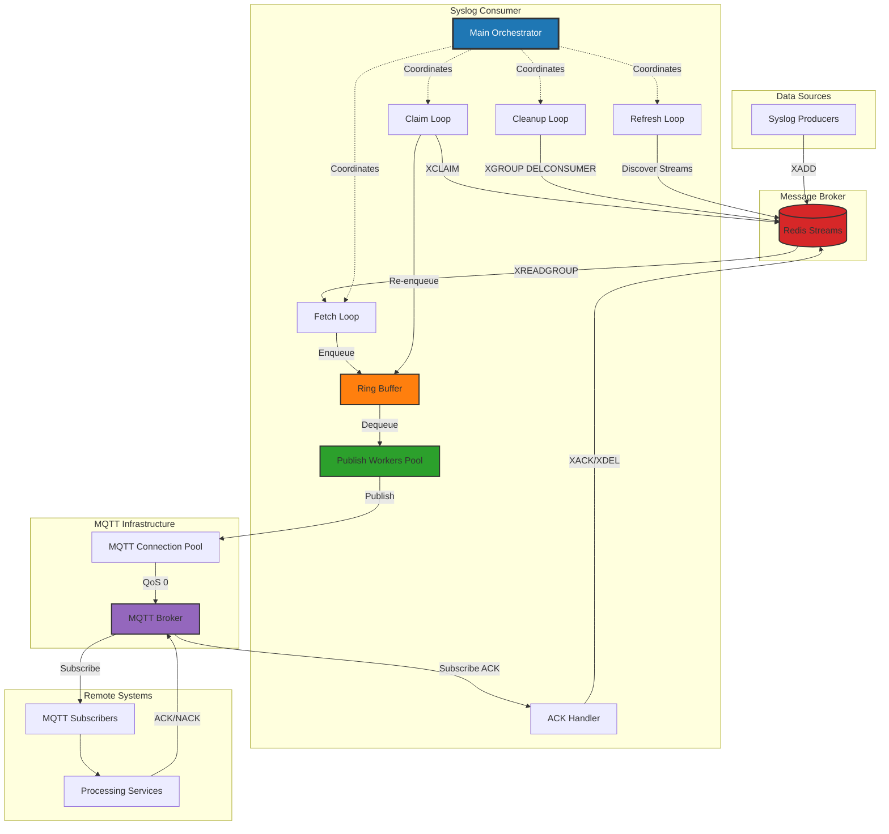

### Component Interaction Diagram

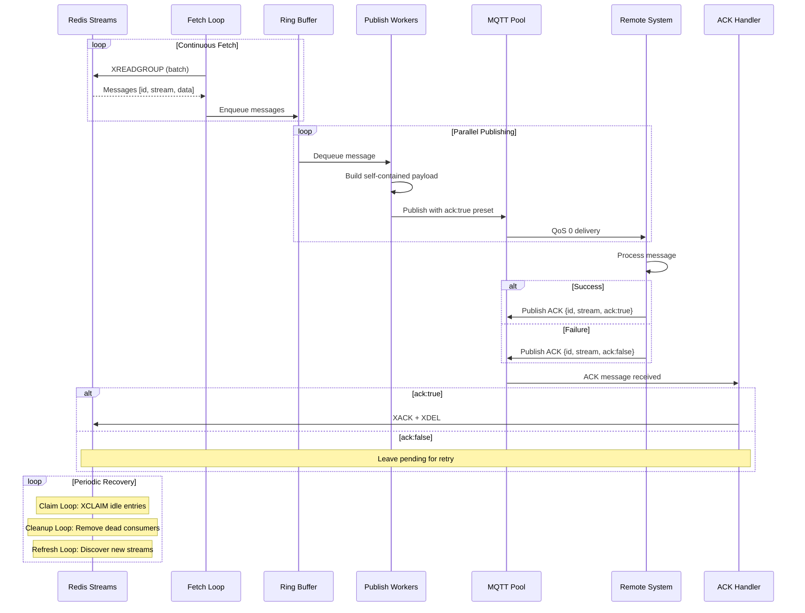

---

## Component Architecture

### 1. Main Orchestrator (`cmd/consumer/main.go`)

**Responsibility**: Application lifecycle management

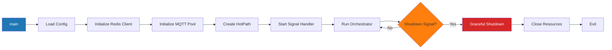

**Key Features**:
- Clean initialization sequence
- Signal handling (SIGINT, SIGTERM)
- Graceful shutdown with timeout
- Resource cleanup with deferred execution

---

### 2. Configuration System (`internal/config/`)

**Responsibility**: Environment-based configuration with validation

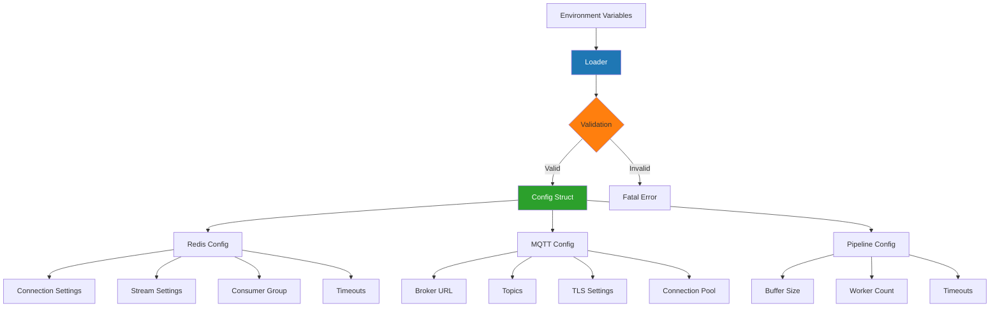

**Configuration Layers**:
1. **Defaults**: Hardcoded production-ready values
2. **Environment**: All configuration via environment variables
3. **Validation**: Strict validation on load (fail-fast)
4. **Runtime Validation**: Additional checks during operation

---

### 3. HotPath Orchestrator (`internal/hotpath/`)

**Responsibility**: Pipeline coordination and parallel execution

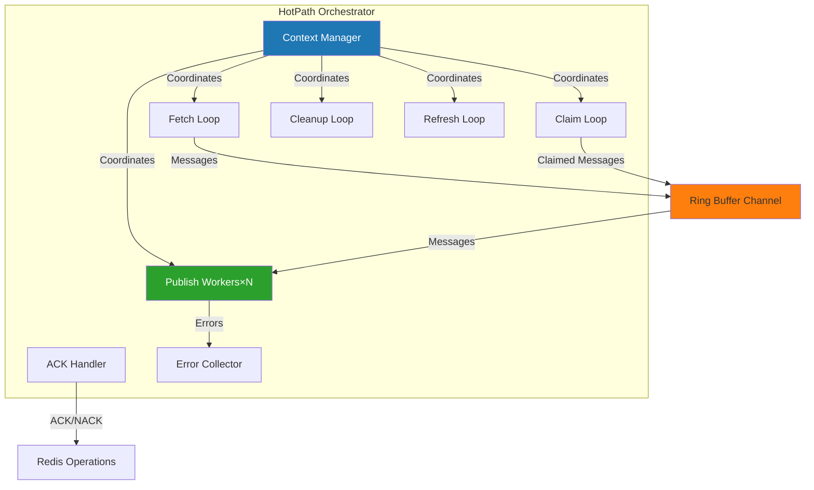

**Concurrency Pattern**:
- **1 Fetch Loop**: Batched reads from Redis
- **1 Claim Loop**: Periodic recovery of stale messages
- **1 Cleanup Loop**: Dead consumer removal
- **1 Refresh Loop**: Stream discovery (multi-stream mode)
- **N Publish Workers**: Configurable parallelism (default: 20)
- **1 ACK Handler**: MQTT callback for acknowledgments

---

### 4. Redis Client (`internal/redis/`)

**Responsibility**: Redis stream operations with multi-stream support

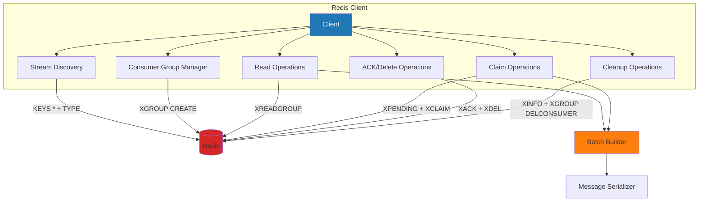

**Operating Modes**:

1. **Single-Stream Mode** (Default)
   - Consumes from one specified stream
   - Consumer group: `group-{streamname}`

2. **Multi-Stream Mode** (REDIS_STREAM="")
   - Auto-discovers all Redis streams
   - Creates consumer groups dynamically
   - Periodic refresh for new streams
   - Parallel consumption via XREADGROUP multi-stream

---

### 5. MQTT Connection Pool (`internal/mqtt/`)

**Responsibility**: High-throughput MQTT publishing with connection pooling

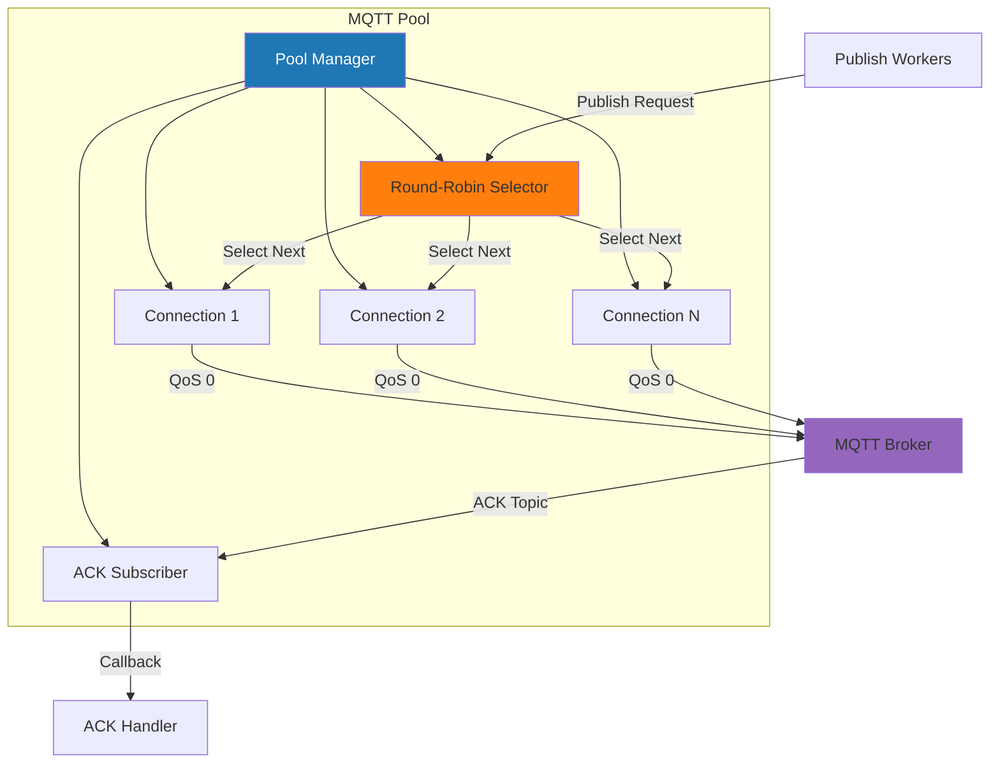

**Pool Characteristics**:
- **Size**: Configurable (default: 10 connections)
- **Selection**: Round-robin with atomic counter
- **Reconnection**: Automatic with exponential backoff
- **QoS**: 0 (fire-and-forget) for maximum throughput
- **TLS**: Optional with certificate validation

---

### 6. Message Format (`internal/message/`)

**Responsibility**: Strongly-typed message structures

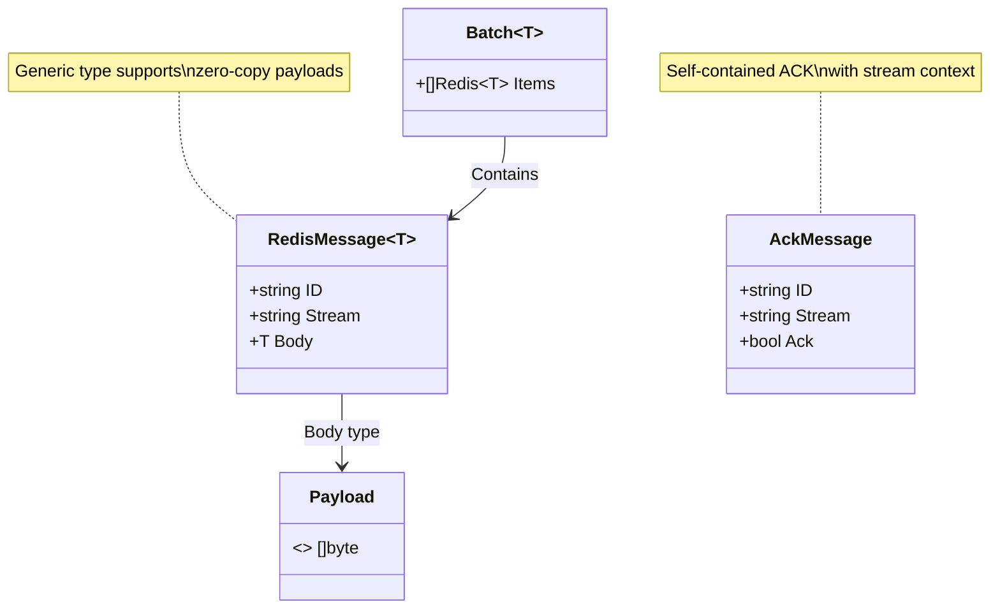

---

## Data Flow

### Message Processing Pipeline

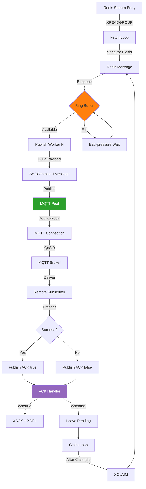

### Payload Structure

**Published Message** (Self-contained format):
```json
{
  "message": {
    "payload": {
      "object": "{\"nested\":\"json\"}",
      "timestamp": "2025-11-08T16:30:00Z",
      "severity": "INFO",
      "facility": "syslog"
    }
  },
  "redis": {
    "payload": {
      "id": "1699459800000-0",
      "stream": "syslog-stream",
      "ack": true
    }
  }
}
```

**ACK Message** (Response from remote system):
```json
{
  "id": "1699459800000-0",
  "stream": "syslog-stream",
  "ack": true
}
```

---

## Concurrency Model

### Goroutine Architecture

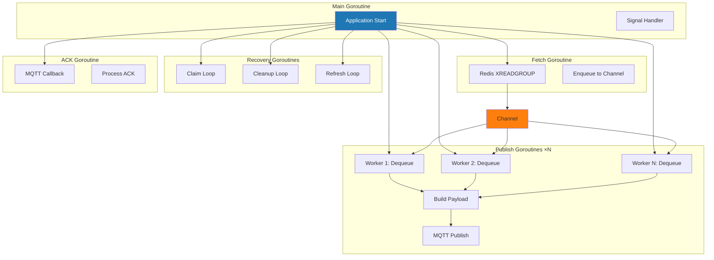

### Synchronization Points

| Component | Synchronization | Mechanism |
|-----------|----------------|-----------|
| Fetch → Workers | Lock-free | Buffered Go channel |
| Workers → MQTT | Lock-free | Round-robin atomic counter |
| MQTT → ACK Handler | Thread-safe | MQTT library callback |
| Shutdown | Coordinated | Context cancellation + WaitGroup |

---

## Performance Characteristics

### Throughput Analysis

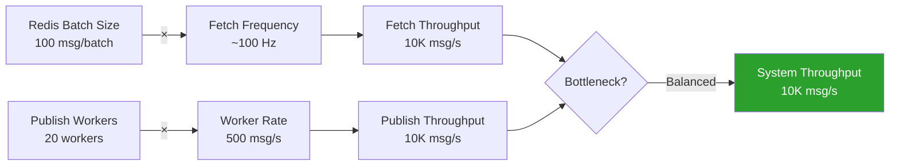

### Latency Breakdown

| Stage | Typical Latency | Notes |
|-------|----------------|-------|
| Redis XREADGROUP | 1-5 ms | Network + Redis processing |
| Channel Enqueue | <0.1 ms | In-memory operation |
| Payload Build | <0.1 ms | Zero-copy construction |
| MQTT Publish | 1-10 ms | Network + broker processing |
| Remote Processing | Variable | Application-dependent |
| ACK Processing | 1-5 ms | Redis XACK + XDEL |
| **Total (P50)** | **10-50 ms** | End-to-end |
| **Total (P99)** | **100-500 ms** | Including retries |

### Resource Utilization

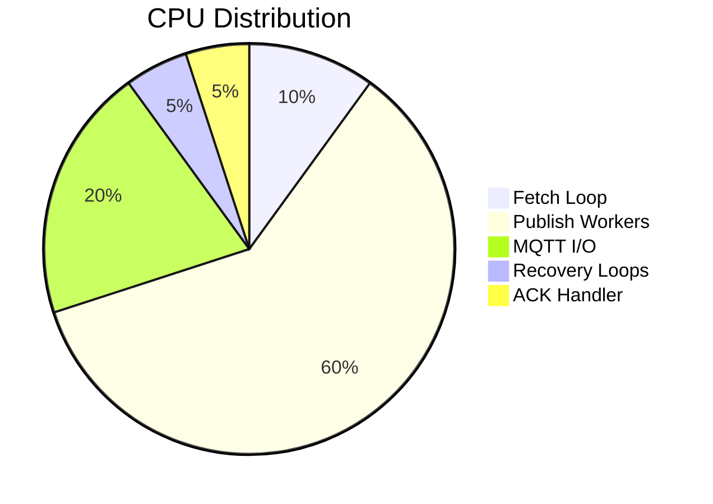

---

## Fault Tolerance & Recovery

### Failure Scenarios & Mitigation

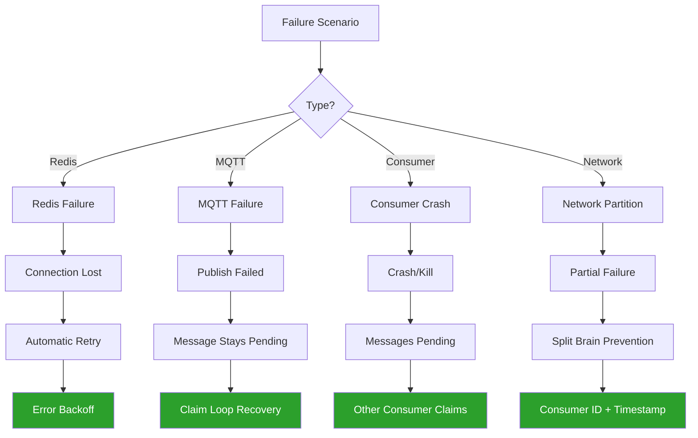

### Recovery Mechanisms

#### 1. Claim Loop (Idle Message Recovery)
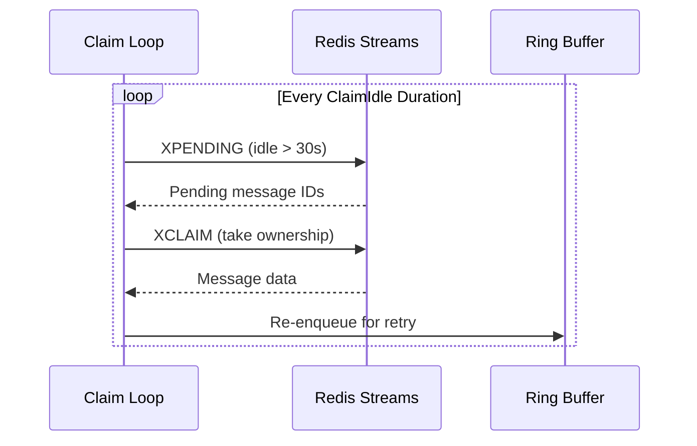

**Configuration**:
- `REDIS_CLAIM_IDLE`: Minimum idle time before claiming (default: 30s)
- Ensures at-least-once delivery
- Handles consumer crashes and transient failures

#### 2. Cleanup Loop (Dead Consumer Removal)
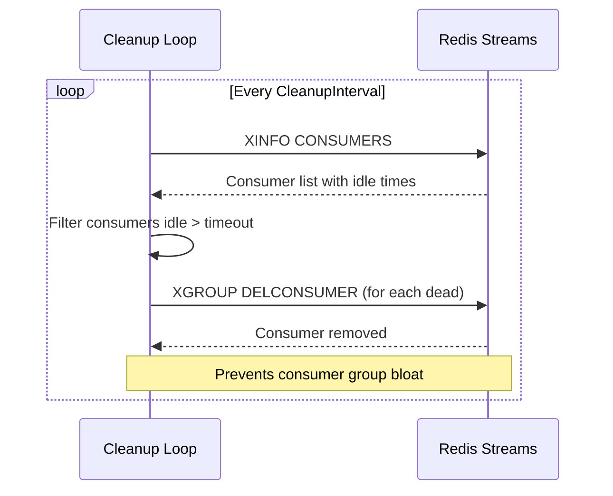

**Configuration**:
- `REDIS_CONSUMER_IDLE_TIMEOUT`: Inactivity threshold (default: 5m)
- `REDIS_CLEANUP_INTERVAL`: Cleanup frequency (default: 1m)

#### 3. Refresh Loop (Stream Discovery)
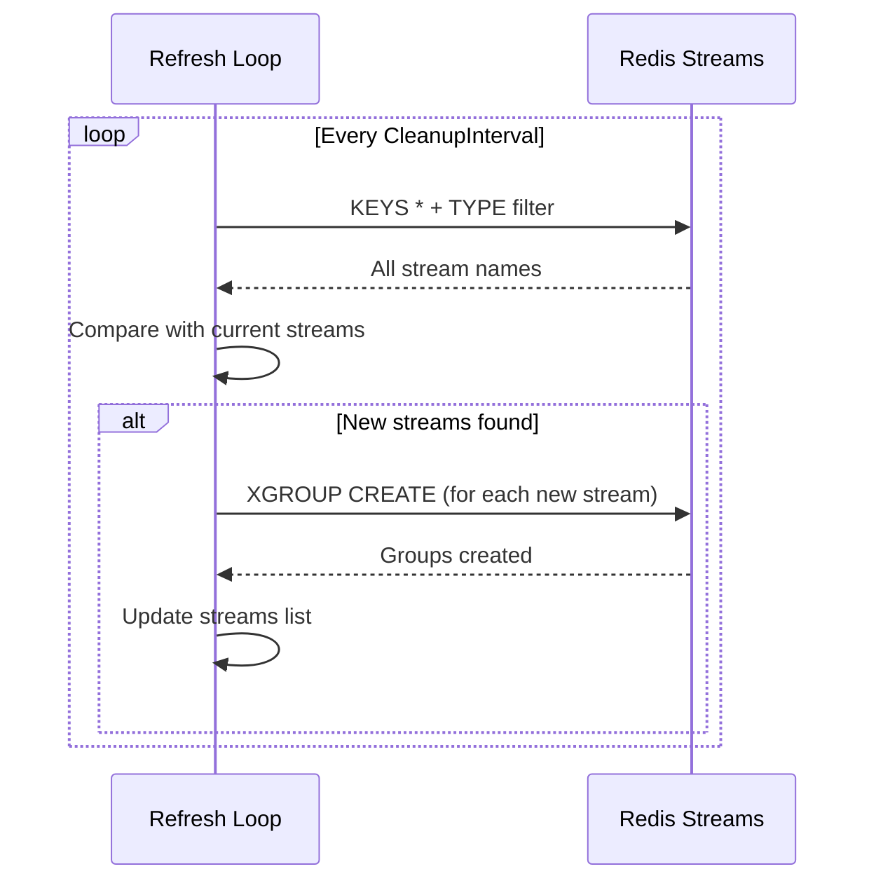

**Features**:
- Dynamic stream discovery
- Automatic consumer group creation
- Zero-downtime stream addition

### Delivery Guarantees

| Scenario | Guarantee | Mechanism |
|----------|-----------|-----------|
| Consumer Crash | At-least-once | Redis pending entries + claim |
| Network Failure | At-least-once | Message stays pending until ACK |
| MQTT Publish Fail | At-least-once | No in-process retry; claim loop recovers |
| Duplicate ACK | Idempotent | XACK/XDEL are idempotent operations |
| Remote Processing | Application-level | ACK true/false determines retry |

---

## Deployment Architecture

### Single Instance Deployment

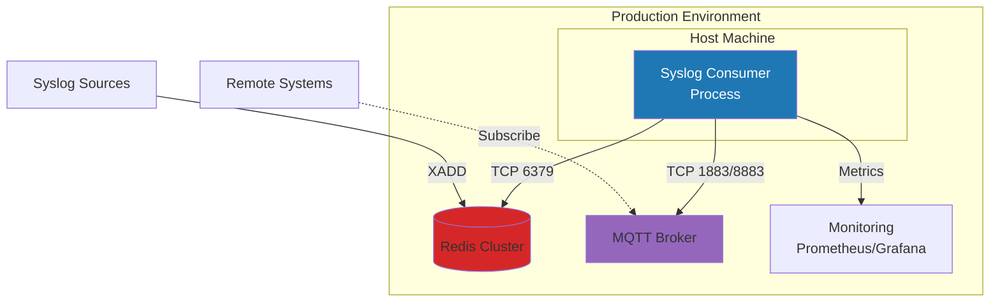

### Multi-Instance Deployment (High Availability)

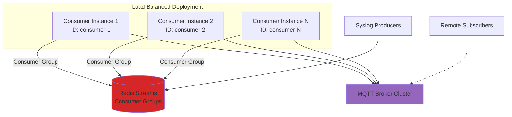

**Scaling Characteristics**:
- **Horizontal**: Add consumer instances with unique IDs
- **Workload Distribution**: Redis consumer groups automatically balance load
- **Fault Tolerance**: Lost consumers' messages reclaimed by surviving instances
- **No Coordination**: Instances operate independently

### Kubernetes Deployment

```yaml
apiVersion: apps/v1
kind: Deployment
metadata:
  name: syslog-consumer
spec:
  replicas: 3
  selector:
    matchLabels:
      app: syslog-consumer
  template:
    metadata:
      labels:
        app: syslog-consumer
    spec:
      containers:
      - name: consumer
        image: syslog-consumer:latest
        env:
        - name: REDIS_ADDRESS
          value: "redis-service:6379"
        - name: MQTT_BROKER
          value: "tcp://mqtt-service:1883"
        - name: REDIS_CONSUMER
          valueFrom:
            fieldRef:
              fieldPath: metadata.name
        resources:
          requests:
            memory: "256Mi"
            cpu: "500m"
          limits:
            memory: "512Mi"
            cpu: "1000m"
```

---

## Monitoring & Observability

### Key Metrics

| Metric | Type | Description |
|--------|------|-------------|
| `messages_fetched_total` | Counter | Total messages fetched from Redis |
| `messages_published_total` | Counter | Total messages published to MQTT |
| `messages_acked_total` | Counter | Total ACK operations (success) |
| `messages_claimed_total` | Counter | Total messages reclaimed |
| `publish_errors_total` | Counter | Failed MQTT publish attempts |
| `buffer_utilization` | Gauge | Ring buffer fill percentage |
| `publish_latency_seconds` | Histogram | End-to-end publish latency |

### Health Checks

```go
// Readiness: Can accept work
- Redis connection active
- MQTT pool connected
- ACK subscription active

// Liveness: Still functioning
- Fetch loop responsive
- Publish workers active
- No panic/crash state
```

---

## Security Considerations

### TLS Configuration

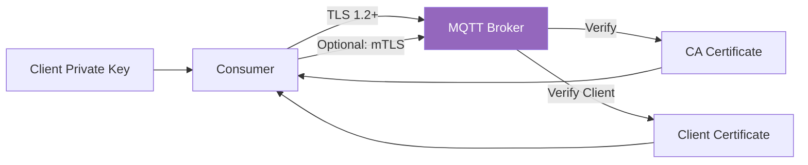

### Access Control

| Component | Authentication | Authorization |
|-----------|---------------|---------------|
| Redis | Optional: AUTH | ACL (if configured) |
| MQTT | Optional: username/password | Topic ACL via broker |
| TLS | Certificate-based | CN-based topic prefix |

---

## Appendix

### Configuration Reference

See [README.md](README.md) for complete environment variable reference.

### Testing Strategy

- **Unit Tests**: Component-level validation
- **Integration Tests**: Redis + MQTT full pipeline
- **Benchmarks**: Performance regression detection
- **Coverage Target**: >80% code coverage

### Performance Tuning

| Parameter | Low Load | High Load | Notes |
|-----------|----------|-----------|-------|
| REDIS_BATCH_SIZE | 50 | 200 | Larger batches = fewer round trips |
| MQTT_POOL_SIZE | 5 | 20 | Match publish worker count |
| PIPELINE_PUBLISH_WORKERS | 10 | 50 | CPU-bound scaling |
| PIPELINE_BUFFER_CAPACITY | 500 | 5000 | Memory vs. backpressure |

### Troubleshooting

| Issue | Symptom | Solution |
|-------|---------|----------|
| High latency | Messages delayed >1s | Increase publish workers |
| Memory growth | OOM errors | Reduce buffer capacity |
| Message loss | Missing messages | Check claim idle timeout |
| Connection flapping | Frequent reconnects | Tune MQTT timeouts |

---

**Document Version**: 1.0.0  
**Last Updated**: 2025-11-08  
**Maintainer**: IBS Source  
**License**: See LICENSE file
