# System Architecture

## Overview

The Syslog Consumer is a high-performance, production-grade Redis-to-MQTT message pipeline designed for zero-data-loss message processing. It implements a **lock-free hot path** with sophisticated error recovery mechanisms.

### Key Design Principles

- **Zero-Copy Processing**: Payload data is never unnecessarily copied
- **Lock-Free Pipeline**: Go channels for thread-safe communication without mutexes
- **Stateless Design**: No local caching; all state in Redis for crash recovery
- **Self-Contained Messages**: Each message carries all metadata needed for processing
- **Horizontal Scalability**: Multiple consumer instances share workload via Redis consumer groups

### Technical Specifications

| Metric | Value |
|--------|-------|
| Language | Go 1.25+ |
| Concurrency Model | CSP (Communicating Sequential Processes) |
| Memory Model | Zero-copy, lock-free message passing |
| Latency | Sub-millisecond hot path (P99) |
| Reliability | At-least-once delivery guarantee |

---

## System Architecture

### High-Level Architecture

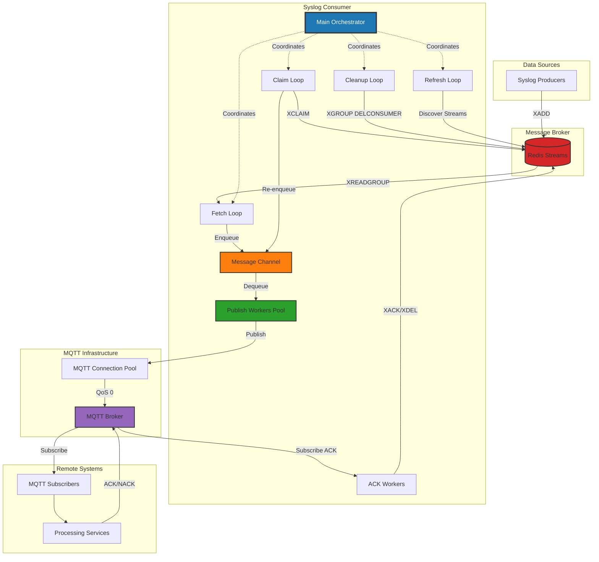
```mermaid
graph TB
    subgraph "Data Sources"
        A[Syslog Producers]
    end
    
    subgraph "Message Broker"
        B[(Redis Streams)]
    end
    
    subgraph "Syslog Consumer"
        C[Main Orchestrator]
        D[Fetch Loop]
        E[Message Channel]
        F[Publish Workers Pool]
        G[Claim Loop]
        H[Cleanup Loop]
        I[Refresh Loop]
        J[ACK Workers]
    end
    
    subgraph "MQTT Infrastructure"
        K[MQTT Connection Pool]
        L[MQTT Broker]
    end
    
    subgraph "Remote Systems"
        M[MQTT Subscribers]
        N[Processing Services]
    end
    
    A -->|XADD| B
    B -->|XREADGROUP| D
    D -->|Enqueue| E
    E -->|Dequeue| F
    F -->|Publish| K
    K -->|QoS 0| L
    L -->|Subscribe| M
    M --> N
    N -->|ACK/NACK| L
    L -->|Subscribe ACK| J
    J -->|XACK/XDEL| B
    G -->|XCLAIM| B
    G -->|Re-enqueue| E
    H -->|XGROUP DELCONSUMER| B
    I -->|Discover Streams| B
    C -.Coordinates.-> D
    C -.Coordinates.-> G
    C -.Coordinates.-> H
    C -.Coordinates.-> I
    
    style C fill:#1f77b4,stroke:#333,stroke-width:3px,color:#fff
    style E fill:#ff7f0e,stroke:#333,stroke-width:2px
    style F fill:#2ca02c,stroke:#333,stroke-width:2px
    style B fill:#d62728,stroke:#333,stroke-width:2px
    style L fill:#9467bd,stroke:#333,stroke-width:2px
```

### Component Interaction Diagram

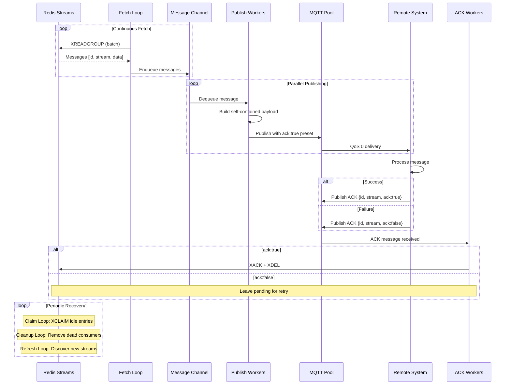
```mermaid
sequenceDiagram
    participant Redis as Redis Streams
    participant Fetch as Fetch Loop
    participant Buffer as Message Channel
    participant Worker as Publish Workers
    participant MQTT as MQTT Pool
    participant Remote as Remote System
    participant ACK as ACK Workers
    
    loop Continuous Fetch
        Fetch->>Redis: XREADGROUP (batch)
        Redis-->>Fetch: Messages [id, stream, data]
        Fetch->>Buffer: Enqueue messages
    end
    
    loop Parallel Publishing
        Buffer->>Worker: Dequeue message
        Worker->>Worker: Build self-contained payload
        Worker->>MQTT: Publish with ack:true preset
        MQTT->>Remote: QoS 0 delivery
    end
    
    Remote->>Remote: Process message
    alt Success
        Remote->>MQTT: Publish ACK {id, stream, ack:true}
    else Failure
        Remote->>MQTT: Publish ACK {id, stream, ack:false}
    end
    
    MQTT->>ACK: ACK message received
    alt ack:true
        ACK->>Redis: XACK + XDEL
    else ack:false
        Note over ACK,Redis: Leave pending for retry
    end
    
    loop Periodic Recovery
        Note over Redis: Claim Loop: XCLAIM idle entries
        Note over Redis: Cleanup Loop: Remove dead consumers
        Note over Redis: Refresh Loop: Discover new streams
    end
```

---

## Component Architecture

### 1. Main Orchestrator (`cmd/consumer/main.go`)

**Responsibility**: Application lifecycle management

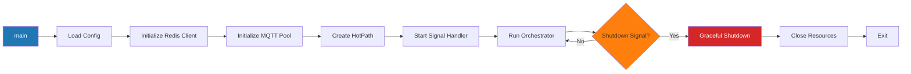
```mermaid
graph LR
    A[main] --> B[Load Config]
    B --> C[Initialize Redis Client]
    C --> D[Initialize MQTT Pool]
    D --> E[Create HotPath]
    E --> F[Start Signal Handler]
    F --> G[Run Orchestrator]
    G --> H{Shutdown Signal?}
    H -->|Yes| I[Graceful Shutdown]
    H -->|No| G
    I --> J[Close Resources]
    J --> K[Exit]
    
    style A fill:#1f77b4,color:#fff
    style H fill:#ff7f0e
    style I fill:#d62728,color:#fff
```

**Key Features**:
- Clean initialization sequence
- Signal handling (SIGINT, SIGTERM)
- Graceful shutdown with timeout
- Resource cleanup with deferred execution

---

### 2. Configuration System (`internal/config/`)

**Responsibility**: Environment-based configuration with validation

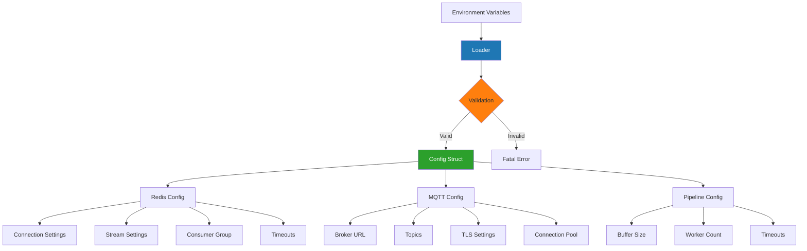
```mermaid
graph TB
    A[Environment Variables] --> B[Loader]
    B --> C{Validation}
    C -->|Valid| D[Config Struct]
    C -->|Invalid| E[Fatal Error]
    D --> F[Redis Config]
    D --> G[MQTT Config]
    D --> H[Pipeline Config]
    
    F --> F1[Connection Settings]
    F --> F2[Stream Settings]
    F --> F3[Consumer Group]
    F --> F4[Timeouts]
    
    G --> G1[Broker URL]
    G --> G2[Topics]
    G --> G3[TLS Settings]
    G --> G4[Connection Pool]
    
    H --> H1[Buffer Size]
    H --> H2[Worker Count]
    H --> H3[Timeouts]
    
    style B fill:#1f77b4,color:#fff
    style C fill:#ff7f0e
    style D fill:#2ca02c,color:#fff
```

**Configuration Layers**:
1. **Defaults**: Hardcoded production-ready values
2. **Environment**: All configuration via environment variables
3. **Validation**: Strict validation on load (fail-fast)
4. **Runtime Validation**: Additional checks during operation

---

### 3. HotPath Orchestrator (`internal/hotpath/`)

**Responsibility**: Pipeline coordination and parallel execution

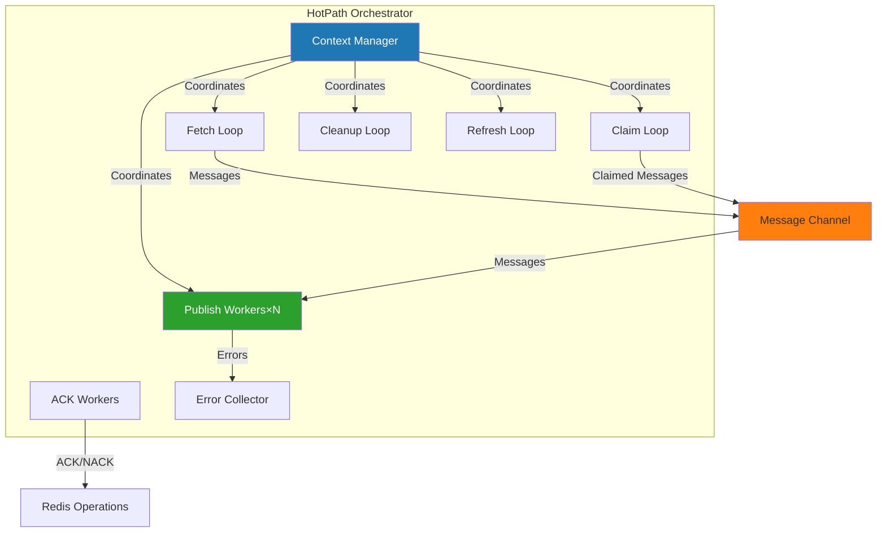
```mermaid
graph TB
    subgraph "HotPath Orchestrator"
        A[Context Manager]
        B[Fetch Loop]
        C[Claim Loop]
        D[Cleanup Loop]
        E[Refresh Loop]
        F[Publish Workers×N]
        G[ACK Workers]
        H[Error Collector]
    end
    
    A -->|Coordinates| B
    A -->|Coordinates| C
    A -->|Coordinates| D
    A -->|Coordinates| E
    A -->|Coordinates| F
    
    B -->|Messages| I[Message Channel]
    C -->|Claimed Messages| I
    I -->|Messages| F
    F -->|Errors| H
    G -->|ACK/NACK| J[Redis Operations]
    
    style A fill:#1f77b4,color:#fff
    style I fill:#ff7f0e
    style F fill:#2ca02c,color:#fff
```

**Concurrency Pattern**:
- **1 Fetch Loop**: Batched reads from Redis
- **1 Claim Loop**: Periodic recovery of stale messages
- **1 Cleanup Loop**: Dead consumer removal
- **1 Refresh Loop**: Stream discovery (multi-stream mode)
- **N Publish Workers**: Configurable parallelism (default: 50)
- **N ACK Workers**: Sharded by stream hash, with single-stream fast path

---

### 4. Redis Client (`internal/redis/`)

**Responsibility**: Redis stream operations with multi-stream support

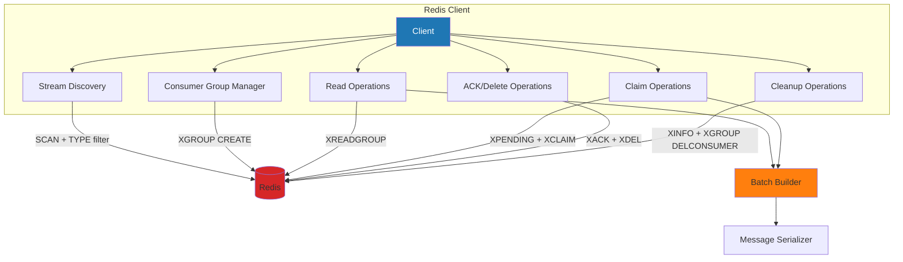
```mermaid
graph TB
    subgraph "Redis Client"
        A[Client]
        B[Stream Discovery]
        C[Consumer Group Manager]
        D[Read Operations]
        E[Claim Operations]
        F[ACK/Delete Operations]
        G[Cleanup Operations]
    end
    
    A --> B
    A --> C
    A --> D
    A --> E
    A --> F
    A --> G
    
    B -->|SCAN + TYPE filter| H[(Redis)]
    C -->|XGROUP CREATE| H
    D -->|XREADGROUP| H
    E -->|XPENDING + XCLAIM| H
    F -->|XACK + XDEL| H
    G -->|XINFO + XGROUP DELCONSUMER| H
    
    D --> I[Batch Builder]
    E --> I
    I --> J[Message Serializer]
    
    style A fill:#1f77b4,color:#fff
    style H fill:#d62728
    style I fill:#ff7f0e
```

**Operating Modes**:

1. **Single-Stream Mode** (Default)
   - Consumes from one specified stream
   - Consumer group: `consumer-group` by default (configurable via `REDIS_GROUP_NAME`)

2. **Multi-Stream Mode** (REDIS_STREAM="")
   - Auto-discovers all Redis streams
   - Creates consumer groups dynamically
   - Periodic refresh for new streams
   - Parallel consumption via XREADGROUP multi-stream

---

### 5. MQTT Connection Pool (`internal/mqtt/`)

**Responsibility**: MQTT publishing with connection pooling

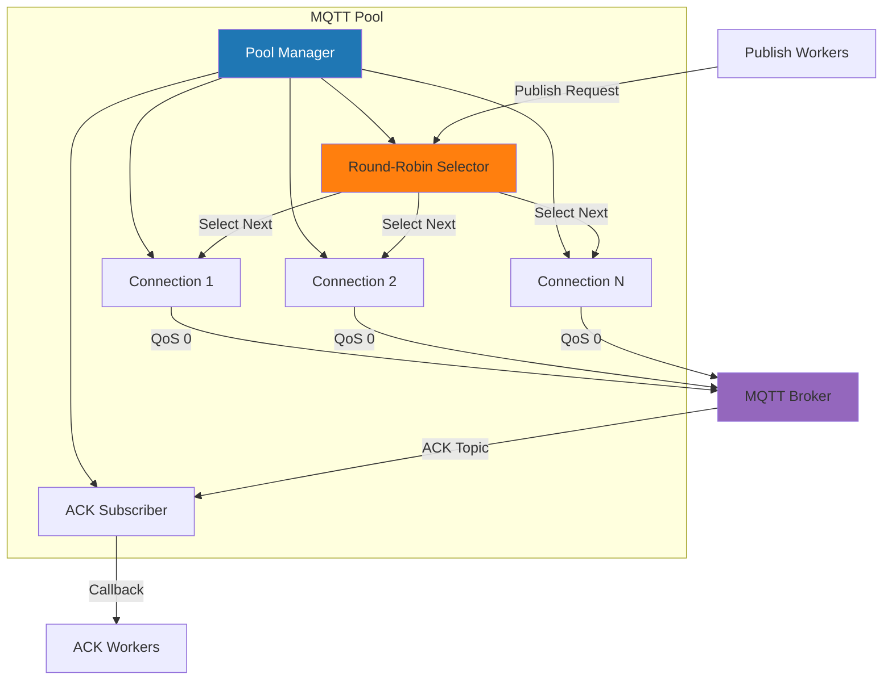
```mermaid
graph TB
    subgraph "MQTT Pool"
        A[Pool Manager]
        B[Connection 1]
        C[Connection 2]
        D[Connection N]
        E[Round-Robin Selector]
        F[ACK Subscriber]
    end
    
    A --> B
    A --> C
    A --> D
    A --> E
    A --> F
    
    G[Publish Workers] -->|Publish Request| E
    E -->|Select Next| B
    E -->|Select Next| C
    E -->|Select Next| D
    
    B -->|QoS 0| H[MQTT Broker]
    C -->|QoS 0| H
    D -->|QoS 0| H
    
    H -->|ACK Topic| F
    F -->|Callback| I[ACK Workers]
    
    style A fill:#1f77b4,color:#fff
    style E fill:#ff7f0e
    style H fill:#9467bd
```

**Pool Characteristics**:
- **Size**: Configurable (default: 25 connections)
- **Selection**: Per-worker hint via PublishFrom (zero contention)
- **Reconnection**: Automatic with exponential backoff
- **QoS**: 0 (fire-and-forget)
- **TLS**: Optional with certificate validation

---

### 6. Message Format (`internal/message/`)

**Responsibility**: Strongly-typed message structures

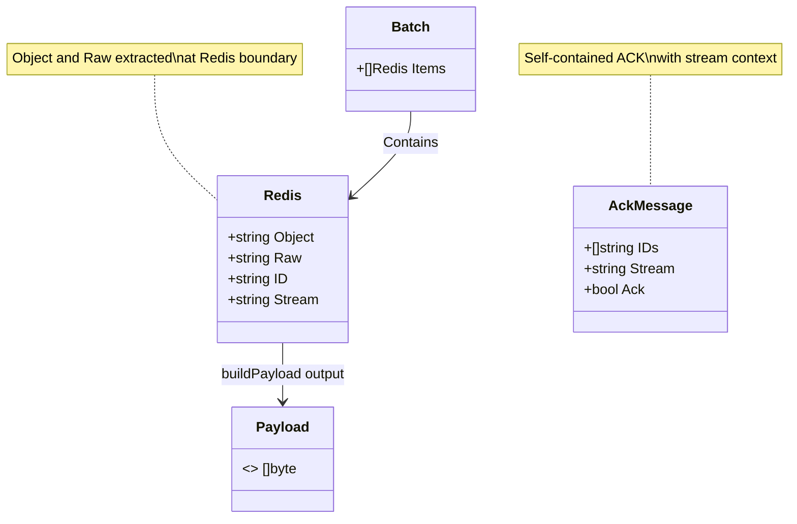
```mermaid
classDiagram
    class Redis {
        +string Object
        +string Raw
        +string ID
        +string Stream
    }
    
    class Batch {
        +[]Redis Items
    }
    
    class AckMessage {
        +[]string IDs
        +string Stream
        +bool Ack
    }
    
    class Payload {
        <<type>> []byte
    }
    
    Redis --> Payload : buildPayload output
    Batch --> Redis : Contains
    
    note for Redis "Object and Raw extracted\nat Redis boundary"
    note for AckMessage "Self-contained ACK\nwith stream context"
```

---

## Data Flow

### Message Processing Pipeline

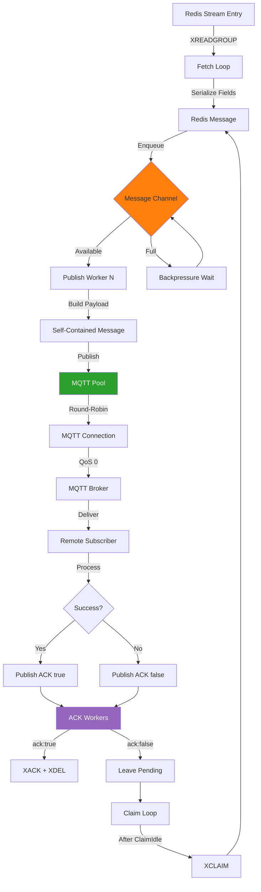
```mermaid
graph TB
    A[Redis Stream Entry] -->|XREADGROUP| B[Fetch Loop]
    B -->|Serialize Fields| C[Redis Message]
    C -->|Enqueue| D{Message Channel}
    D -->|Available| E[Publish Worker N]
    D -->|Full| F[Backpressure Wait]
    F --> D
    
    E -->|Build Payload| G[Self-Contained Message]
    G -->|Publish| H[MQTT Pool]
    H -->|Round-Robin| I[MQTT Connection]
    I -->|QoS 0| J[MQTT Broker]
    
    J -->|Deliver| K[Remote Subscriber]
    K -->|Process| L{Success?}
    L -->|Yes| M[Publish ACK true]
    L -->|No| N[Publish ACK false]
    
    M --> O[ACK Workers]
    N --> O
    
    O -->|ack:true| P[XACK + XDEL]
    O -->|ack:false| Q[Leave Pending]
    
    Q --> R[Claim Loop]
    R -->|After ClaimIdle| S[XCLAIM]
    S --> C
    
    style D fill:#ff7f0e
    style H fill:#2ca02c,color:#fff
    style O fill:#9467bd,color:#fff
```

### Payload Structure

**Published Message** (Tab-separated NDJSON line: `id\tstream\t{flat event JSON}`):
```
1699459800000-0	syslog-stream	{"timestamp":"2025-11-08T16:30:00Z","severity":"Info","facility":"syslog","raw":"-","sd_key":"val"}
```

- `id` and `stream` are tab-prefixed for zero-alloc ACK routing by the receiver.
- The JSON body is a flat object: `structured_data` fields are flattened with `sd_` prefix, severity is mapped to a human-readable name, and `raw` is the original syslog line (`"-"` when empty).

**ACK Message** (Response from remote system):
```json
{
  "ids": ["1699459800000-0"],
  "stream": "syslog-stream",
  "ack": true
}
```

---

## Concurrency Model

### Goroutine Architecture

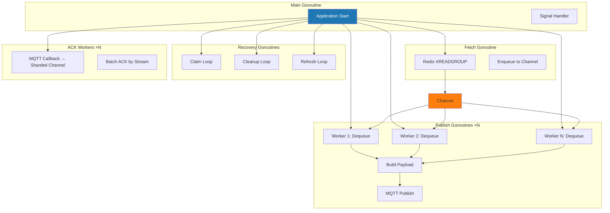
```mermaid
graph TB
    subgraph "Main Goroutine"
        A[Application Start]
        B[Signal Handler]
    end
    
    subgraph "Fetch Goroutine"
        C[Redis XREADGROUP]
        D[Enqueue to Channel]
    end
    
    subgraph "Publish Goroutines ×N"
        E1[Worker 1: Dequeue]
        E2[Worker 2: Dequeue]
        EN[Worker N: Dequeue]
        F[Build Payload]
        G[MQTT Publish]
    end
    
    subgraph "Recovery Goroutines"
        H[Claim Loop]
        I[Cleanup Loop]
        J[Refresh Loop]
    end
    
    subgraph "ACK Workers ×N"
        K[MQTT Callback → Sharded Channel]
        L[Batch ACK by Stream]
    end
    
    A --> C
    A --> E1
    A --> E2
    A --> EN
    A --> H
    A --> I
    A --> J
    A --> K
    
    C --> M[Channel]
    M --> E1
    M --> E2
    M --> EN
    
    E1 --> F
    E2 --> F
    EN --> F
    F --> G
    
    style M fill:#ff7f0e
    style A fill:#1f77b4,color:#fff
```

### Synchronization Points

| Component | Synchronization | Mechanism |
|-----------|----------------|-----------|
| Fetch → Workers | Lock-free | Buffered Go channel |
| Workers → MQTT | Lock-free | Per-worker stride counter (PublishFrom) |
| MQTT → ACK Workers | Thread-safe | MQTT callback → sharded channel → batch worker |
| Shutdown | Coordinated | Context cancellation + WaitGroup |

---

## Performance Characteristics

- **Batch channel**: Redis batches are pushed through the pipeline with **one channel send per batch**, not one send per message. This removes a major synchronization hotspot under sustained load.
- **Zero-alloc hot path**: the final MQTT envelope is built directly from Redis values using pooled `jsonfast.Builder` instances, with **0 allocs/op** on the normal publish path.
- **ACK subscription on all MQTT pool connections**: the broker may deliver ACKs on any connection, so every client in the pool subscribes to the ACK topic.
- **Connection-state cache**: publish path checks an `atomic.Bool` instead of calling `IsConnectionOpen()` for every message.
- **Redis pool tuning**: default `PoolSize=50`, `MinIdleConns=10` to avoid client-side connection bottlenecks during fetch/claim/ack concurrency. Idle connections are proactively recycled via `ConnMaxIdleTime=5m` so NAT/conntrack cannot silently drop half-open TCP flows that the pool would otherwise reuse (surfaces as `pool.go: was not able to get a healthy connection` warnings). `ConnMaxLifetime` is left disabled: enabling it synchronizes the expiry of all connections opened at boot, producing a periodic log burst of the same warning without actually improving stability.

> **Future scale-out note:** a single `fetchLoop` with `BatchSize=20000` is currently sufficient. If benchmarks ever show Redis fetch saturation, the next step is **stream sharding with multiple fetch workers**, not more per-message locking.

### Runtime Tuning

Recommended production settings:

- `GOEXPERIMENT=greenteagc` at build time
- `GOGC=200` at runtime for lower GC frequency
- optionally `GOMEMLIMIT=4GiB` (or sized to the host/container memory budget)

### Latency Breakdown

| Stage | Typical Latency | Notes |
|-------|----------------|-------|
| Redis XREADGROUP | 1-5 ms | Network + Redis processing |
| Channel Enqueue | <0.1 ms | In-memory operation |
| Payload Build | <0.1 ms | Zero-copy construction |
| MQTT Publish | 1-10 ms | Network + broker processing |
| Remote Processing | Variable | Application-dependent |
| ACK Processing | 1-5 ms | Redis XACK + XDEL |
| **Total (P50)** | **10-50 ms** | End-to-end |
| **Total (P99)** | **100-500 ms** | Including retries |

### Resource Utilization

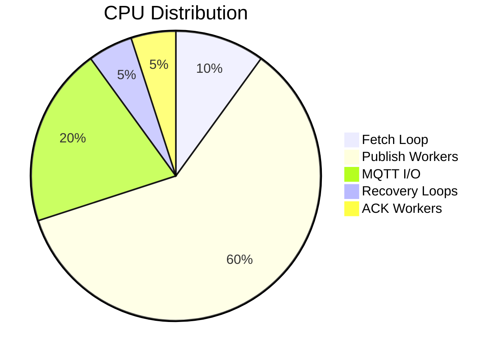
```mermaid
pie title CPU Distribution
    "Fetch Loop" : 10
    "Publish Workers" : 60
    "MQTT I/O" : 20
    "Recovery Loops" : 5
    "ACK Workers" : 5
```

---

## Fault Tolerance & Recovery

### Failure Scenarios & Mitigation

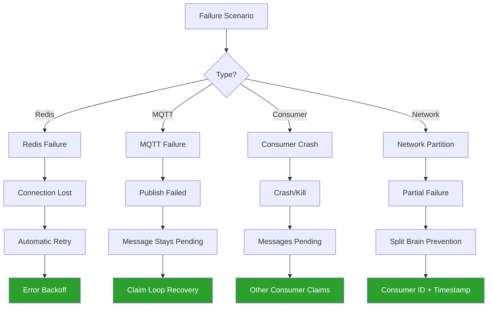
```mermaid
graph TB
    A[Failure Scenario] --> B{Type?}
    
    B -->|Redis| C[Redis Failure]
    B -->|MQTT| D[MQTT Failure]
    B -->|Consumer| E[Consumer Crash]
    B -->|Network| F[Network Partition]
    
    C --> C1[Connection Lost]
    C1 --> C2[Automatic Retry]
    C2 --> C3[Error Backoff]
    
    D --> D1[Publish Failed]
    D1 --> D2[Message Stays Pending]
    D2 --> D3[Claim Loop Recovery]
    
    E --> E1[Crash/Kill]
    E1 --> E2[Messages Pending]
    E2 --> E3[Other Consumer Claims]
    
    F --> F1[Partial Failure]
    F1 --> F2[Split Brain Prevention]
    F2 --> F3[Consumer ID + Timestamp]
    
    style C3 fill:#2ca02c,color:#fff
    style D3 fill:#2ca02c,color:#fff
    style E3 fill:#2ca02c,color:#fff
    style F3 fill:#2ca02c,color:#fff
```

### Recovery Mechanisms

#### 1. Claim Loop (Idle Message Recovery)
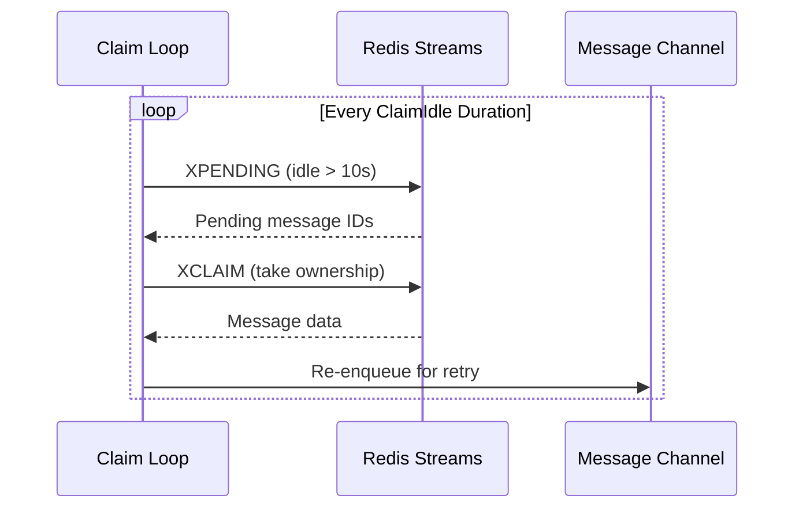
```mermaid
sequenceDiagram
    participant Claim as Claim Loop
    participant Redis as Redis Streams
    participant Buffer as Message Channel
    
    loop Every ClaimIdle Duration
        Claim->>Redis: XPENDING (idle > 10s)
        Redis-->>Claim: Pending message IDs
        Claim->>Redis: XCLAIM (take ownership)
        Redis-->>Claim: Message data
        Claim->>Buffer: Re-enqueue for retry
    end
```

**Configuration**:
- `REDIS_CLAIM_IDLE`: Minimum idle time before claiming (default: 10s)
- Ensures at-least-once delivery
- Handles consumer crashes and transient failures

#### 2. Cleanup Loop (Dead Consumer Removal)
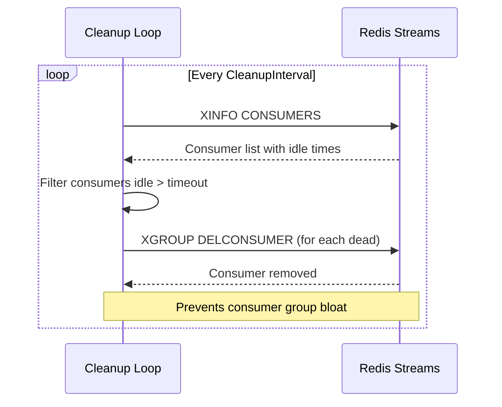
```mermaid
sequenceDiagram
    participant Cleanup as Cleanup Loop
    participant Redis as Redis Streams
    
    loop Every CleanupInterval
        Cleanup->>Redis: XINFO CONSUMERS
        Redis-->>Cleanup: Consumer list with idle times
        Cleanup->>Cleanup: Filter consumers idle > timeout
        Cleanup->>Redis: XGROUP DELCONSUMER (for each dead)
        Redis-->>Cleanup: Consumer removed
        Note over Cleanup,Redis: Prevents consumer group bloat
    end
```

**Configuration**:
- `REDIS_CONSUMER_IDLE_TIMEOUT`: Inactivity threshold (default: 5m)
- `REDIS_CLEANUP_INTERVAL`: Cleanup frequency (default: 1m)

#### 3. Refresh Loop (Stream Discovery)
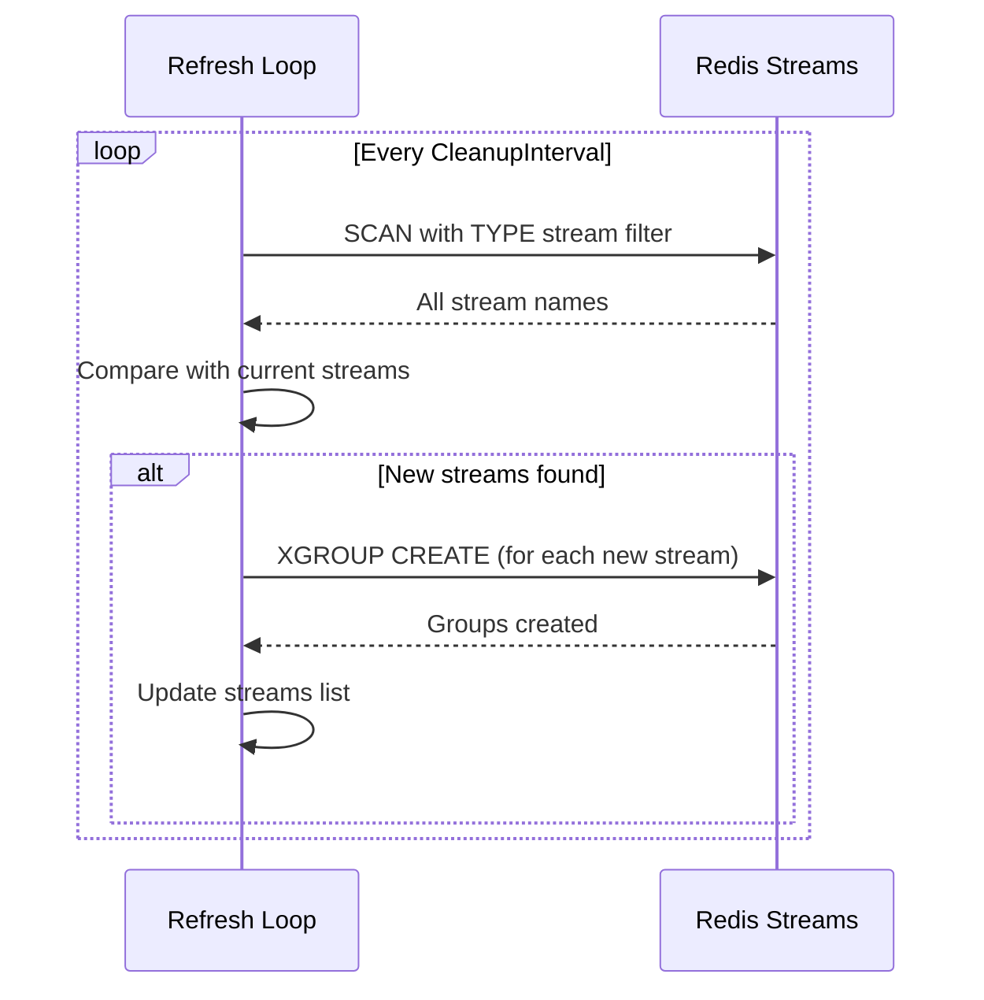
```mermaid
sequenceDiagram
    participant Refresh as Refresh Loop
    participant Redis as Redis Streams
    
    loop Every CleanupInterval
        Refresh->>Redis: SCAN with TYPE stream filter
        Redis-->>Refresh: All stream names
        Refresh->>Refresh: Compare with current streams
        alt New streams found
            Refresh->>Redis: XGROUP CREATE (for each new stream)
            Redis-->>Refresh: Groups created
            Refresh->>Refresh: Update streams list
        end
    end
```

**Features**:
- Dynamic stream discovery
- Automatic consumer group creation
- Zero-downtime stream addition

### Delivery Guarantees

| Scenario | Guarantee | Mechanism |
|----------|-----------|-----------|
| Consumer Crash | At-least-once | Redis pending entries + claim |
| Network Failure | At-least-once | Message stays pending until ACK |
| MQTT Publish Fail | At-least-once | No in-process retry; claim loop recovers |
| Duplicate ACK | Idempotent | XACK/XDEL are idempotent operations |
| Remote Processing | Application-level | ACK true/false determines retry |

---

## Deployment Architecture

### Single Instance Deployment

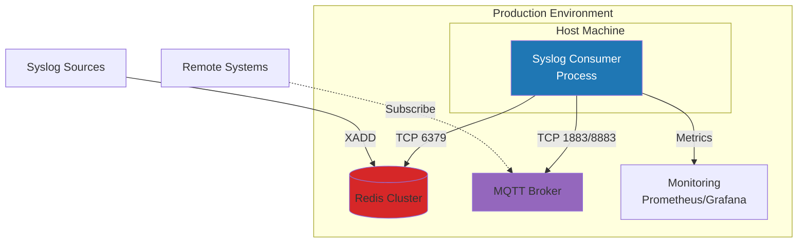
```mermaid
graph TB
    subgraph "Production Environment"
        subgraph "Host Machine"
            A[Syslog Consumer<br/>Process]
        end
        
        B[(Redis Cluster)]
        C[MQTT Broker]
        D[Monitoring<br/>Prometheus/Grafana]
    end
    
    A -->|TCP 6379| B
    A -->|TCP 1883/8883| C
    A -->|Metrics| D
    
    E[Syslog Sources] -->|XADD| B
    F[Remote Systems] -.Subscribe.-> C
    
    style A fill:#1f77b4,color:#fff
    style B fill:#d62728
    style C fill:#9467bd
```

### Multi-Instance Deployment (High Availability)

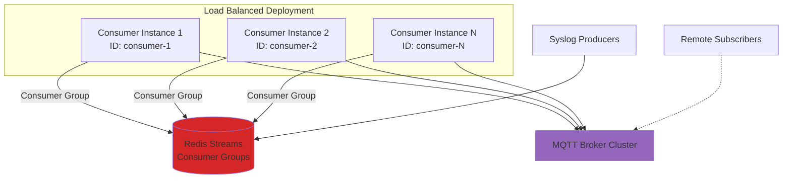
```mermaid
graph TB
    subgraph "Load Balanced Deployment"
        A1[Consumer Instance 1<br/>ID: consumer-1]
        A2[Consumer Instance 2<br/>ID: consumer-2]
        A3[Consumer Instance N<br/>ID: consumer-N]
    end
    
    B[(Redis Streams<br/>Consumer Groups)]
    C[MQTT Broker Cluster]
    
    A1 -->|Consumer Group| B
    A2 -->|Consumer Group| B
    A3 -->|Consumer Group| B
    
    A1 --> C
    A2 --> C
    A3 --> C
    
    D[Syslog Producers] --> B
    E[Remote Subscribers] -.-> C
    
    style B fill:#d62728
    style C fill:#9467bd
```

**Scaling Characteristics**:
- **Horizontal**: Add consumer instances with unique IDs
- **Workload Distribution**: Redis consumer groups automatically balance load
- **Fault Tolerance**: Lost consumers' messages reclaimed by surviving instances
- **No Coordination**: Instances operate independently

### Kubernetes Deployment

```yaml
apiVersion: apps/v1
kind: Deployment
metadata:
  name: syslog-consumer
spec:
  replicas: 3
  selector:
    matchLabels:
      app: syslog-consumer
  template:
    metadata:
      labels:
        app: syslog-consumer
    spec:
      containers:
      - name: consumer
        image: syslog-consumer:latest
        env:
        - name: REDIS_ADDRESS
          value: "redis-service:6379"
        - name: MQTT_BROKER
          value: "tcp://mqtt-service:1883"
        - name: REDIS_CONSUMER
          valueFrom:
            fieldRef:
              fieldPath: metadata.name
        resources:
          requests:
            memory: "256Mi"
            cpu: "500m"
          limits:
            memory: "512Mi"
            cpu: "1000m"
```

---

## Security Considerations

### TLS Configuration

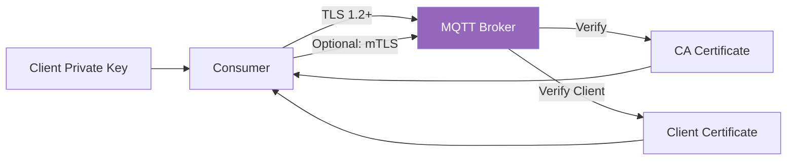
```mermaid
graph LR
    A[Consumer] -->|TLS 1.2+| B[MQTT Broker]
    A -->|Optional: mTLS| B
    
    C[CA Certificate] --> A
    D[Client Certificate] --> A
    E[Client Private Key] --> A
    
    B -->|Verify| C
    B -->|Verify Client| D
    
    style B fill:#9467bd,color:#fff
```

### Access Control

| Component | Authentication | Authorization |
|-----------|---------------|---------------|
| Redis | Optional: AUTH | ACL (if configured) |
| MQTT | Optional: username/password | Topic ACL via broker |
| TLS | Certificate-based | CN-based topic prefix |

---

## Appendix

### Configuration Reference

See [README.md](README.md) for complete environment variable reference.

### Testing Strategy

- **Unit Tests**: Component-level validation
- **Integration Tests**: Redis + MQTT full pipeline
- **Benchmarks**: Performance regression detection
- **Coverage Target**: >80% code coverage

### Performance Tuning

| Parameter | Low Load | Default | High Load | Notes |
|-----------|----------|---------|-----------|-------|
| REDIS_BATCH_SIZE | 500 | 20000 | 50000 | Larger batches = fewer round trips |
| MQTT_POOL_SIZE | 5 | 20 | 100 | Match publish worker count |
| PIPELINE_PUBLISH_WORKERS | 10 | 50 | 100 | CPU-bound scaling |
| PIPELINE_BUFFER_CAPACITY | 5000 | 10000 | 50000 | Memory vs. backpressure |

### Troubleshooting

| Issue | Symptom | Solution |
|-------|---------|----------|
| High latency | Messages delayed >1s | Increase publish workers |
| Memory growth | OOM errors | Reduce buffer capacity |
| Message loss | Missing messages | Check claim idle timeout |
| Connection flapping | Frequent reconnects | Tune MQTT timeouts |

---

For security policy and vulnerability reporting, see [SECURITY.md](SECURITY.md).
