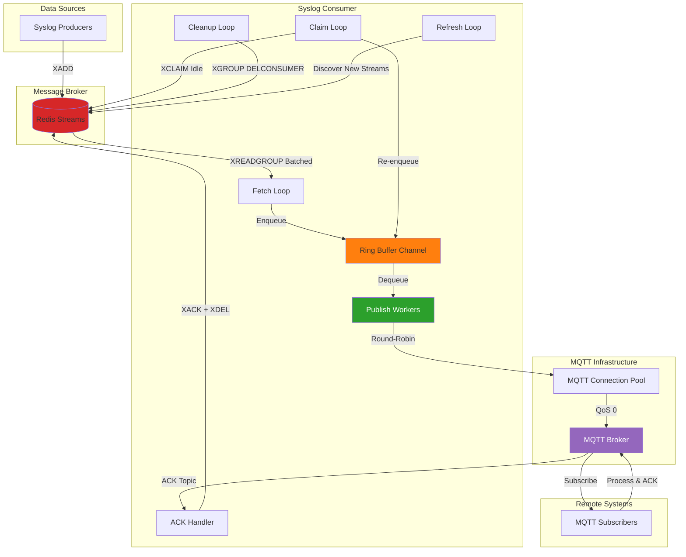

# Syslog Consumer

**Production-grade, high-performance Redis Streams to MQTT message pipeline with zero-data-loss guarantees.**

[](https://go.dev/)
[](LICENSE)
[](ARCHITECTURE.md)

---

## Overview

The Syslog Consumer is a production-ready, horizontally-scalable message processing system designed for high-throughput Redis Streams to MQTT pipelines. It implements a lock-free hot path with sophisticated error recovery mechanisms, ensuring reliable message delivery with at-least-once guarantees.

### Key Features

- **High Performance**: 10,000+ messages/second throughput
- **Zero-Copy Processing**: Efficient payload handling without unnecessary memory operations
- **Lock-Free Pipeline**: Go channels for thread-safe communication without mutexes
- **Redis Streams**: Consumer groups for distributed processing and fault tolerance
- **MQTT Connection Pooling**: Round-robin load balancing across multiple connections
- **Automatic Recovery**: Intelligent claiming of stale messages and dead consumer cleanup
- **Multi-Stream Support**: Dynamic discovery and parallel consumption of multiple streams
- **ACK-Based Reliability**: Application-level acknowledgments via MQTT for message finalization
- **TLS/mTLS Support**: Full encryption and mutual authentication
- **Graceful Shutdown**: Clean resource cleanup with configurable timeouts
- **Comprehensive Testing**: Unit tests, integration tests, and benchmarks

### Design Principles

1. **Stateless Design**: All state stored in Redis for crash recovery
2. **Self-Contained Messages**: Each message carries complete metadata for processing
3. **Fail-Fast Configuration**: Validate all settings at startup
4. **Horizontal Scalability**: Add instances without coordination
5. **Observable**: Structured logging with configurable levels

## Table of Contents

- [Quick Start](#quick-start)
- [Project Structure](#project-structure)
- [Architecture](#architecture)
- [Configuration](#configuration)
- [Operating Modes](#operating-modes)
- [Message Format](#message-format)
- [Deployment](#deployment)
- [Monitoring](#monitoring)
- [Testing](#testing)
- [Troubleshooting](#troubleshooting)
- [Documentation](#documentation)

## Quick Start

### Prerequisites

- **Go**: Version 1.24 or higher
- **Redis**: Version 6.0+ with Streams support
- **MQTT Broker**: Any MQTT 3.1.1 compatible broker (Mosquitto, HiveMQ, etc.)

### Installation

```bash
# Clone the repository
git clone https://github.com/ibs-source/syslog-consumer.git
cd syslog-consumer

# Build the binary
go build -o bin/consumer ./cmd/consumer

# Or use make if available
make build
```

### Basic Usage

```bash
# Run with default configuration
./bin/consumer

# Run with custom configuration
export REDIS_ADDRESS="redis.example.com:6379"
export REDIS_STREAM="your-stream-name"
export MQTT_BROKER="tcp://mqtt.example.com:1883"
./bin/consumer
```

### Docker Deployment

```bash
# Build Docker image
docker build -t syslog-consumer:latest .

# Run container
docker run -d \
  --name syslog-consumer \
  -e REDIS_ADDRESS=redis:6379 \
  -e MQTT_BROKER=tcp://mqtt:1883 \
  syslog-consumer:latest
```

## Project Structure

```
syslog-consumer/
├── cmd/
│   └── consumer/
│       └── main.go                      # Application entry point
│
├── internal/
│   ├── config/                          # Configuration management
│   │   ├── config_structs.go            # Configuration structures
│   │   ├── loader.go                    # Configuration loader
│   │   ├── loader_defaults.go           # Default values
│   │   ├── loader_environment.go        # Environment variable parsing
│   │   ├── loader_validation.go         # Validation rules
│   │   └── *_test.go                    # Tests
│   │
│   ├── hotpath/                         # Pipeline orchestrator
│   │   ├── hotpath.go                   # Core orchestration logic
│   │   └── *_test.go                    # Tests
│   │
│   ├── redis/                           # Redis Streams client
│   │   ├── client.go                    # Stream operations
│   │   ├── cleanup.go                   # Consumer cleanup
│   │   └── *_test.go                    # Tests
│   │
│   ├── mqtt/                            # MQTT client and pool
│   │   ├── client.go                    # MQTT client
│   │   ├── pool.go                      # Connection pooling
│   │   ├── ack.go                       # ACK message parsing
│   │   ├── publisher.go                 # Publisher interface
│   │   └── *_test.go                    # Tests
│   │
│   ├── message/                         # Message types
│   │   ├── message.go                   # Core message structures
│   │   └── *_test.go                    # Tests
│   │
│   └── log/                             # Logging
│       ├── log.go                       # Logger implementation
│       └── *_test.go                    # Tests
│
├── pkg/
│   └── jsonfast/                        # Fast JSON builder
│       ├── jsonfast.go                  # Zero-allocation JSON construction
│       └── *_test.go                    # Tests
│
├── testdata/                            # Test fixtures and TLS certificates
├── ARCHITECTURE.md                      # System architecture documentation
├── CONTRIBUTING.md                      # Contribution guidelines
├── go.mod                               # Go module definition
├── go.sum                               # Dependency checksums
├── LICENSE                              # License file
└── README.md                            # This file
```

## Requirements

- Go 1.24+
- A reachable Redis (Streams) instance
- A reachable MQTT broker

## Build

From the repository root:

```bash
go build -o bin/consumer ./cmd/consumer
```

## Run

```bash
# With defaults
./bin/consumer

# Example custom configuration
export REDIS_ADDRESS="localhost:6379"
export REDIS_STREAM="syslog-stream"
export MQTT_BROKER="tcp://localhost:1883"
./bin/consumer
```

## Configuration

All configuration is provided via environment variables. Defaults shown reflect the current code in `internal/config/config.go`.

### Redis

- REDIS_ADDRESS: Redis server address (default: localhost:6379)
- REDIS_STREAM: stream name (default: syslog-stream). Set to empty string ("") for multi-stream mode
- REDIS_CONSUMER: consumer name (default: consumer-1)
- REDIS_BATCH_SIZE: messages per batch (default: 100)
- REDIS_BLOCK_TIMEOUT: XREADGROUP block timeout (default: 5s)
- REDIS_CLAIM_IDLE: min idle time before reclaiming pending (default: 30s)
- REDIS_CONSUMER_IDLE_TIMEOUT: inactivity for considering consumers "dead" (default: 5m)
- REDIS_CLEANUP_INTERVAL: interval to cleanup dead consumers (default: 1m)
- REDIS_DIAL_TIMEOUT: redis dial timeout (default: 10s)
- REDIS_READ_TIMEOUT: redis read timeout (default: 10s)
- REDIS_WRITE_TIMEOUT: redis write timeout (default: 5s)
- REDIS_PING_TIMEOUT: ping timeout for readiness check (default: 5s)

### MQTT

- MQTT_BROKER: MQTT broker URL (default: tcp://localhost:1883)
- MQTT_CLIENT_ID: client identifier (default: syslog-consumer)
- MQTT_PUBLISH_TOPIC: publish topic (default: syslog/remote/messages)
- MQTT_ACK_TOPIC: subscription topic for ACKs (default: syslog/remote/acknowledgement)
- MQTT_QOS: QoS for publish/subscribe (default: 0)
- MQTT_CONNECT_TIMEOUT: connection timeout (default: 10s)
- MQTT_WRITE_TIMEOUT: publish timeout (default: 5s)
- MQTT_POOL_SIZE: connections in the pool (default: 10)
- MQTT_MAX_RECONNECT_INTERVAL: max reconnect backoff (default: 10s)
- MQTT_SUBSCRIBE_TIMEOUT: subscribe timeout (default: 10s)
- MQTT_DISCONNECT_TIMEOUT: graceful disconnect ms (default: 1000)

TLS (optional):
- MQTT_TLS_ENABLED: “true” to enable TLS (default: false)
- MQTT_CA_CERT: path to CA certificate
- MQTT_CLIENT_CERT: path to client certificate
- MQTT_CLIENT_KEY: path to client key
- MQTT_TLS_INSECURE_SKIP: “true” to skip verification (default: false)
- MQTT_USE_CERT_CN_PREFIX: "true" to prefix topics with certificate CN for ACL constraints (default: false)

### Pipeline

- PIPELINE_BUFFER_CAPACITY: ring buffer capacity (default: 1000)
- PIPELINE_SHUTDOWN_TIMEOUT: graceful shutdown timeout (default: 30s)
- PIPELINE_BUFFER_WAIT: sleep when buffer full/empty (default: 10ms)
- PIPELINE_ERROR_BACKOFF: sleep on redis error (default: 1s)
- PIPELINE_ACK_TIMEOUT: timeout for Redis ACK operations (default: 5s)
- PIPELINE_PUBLISH_WORKERS: number of concurrent publish workers (default: 20)

## Consumer Groups

**Consumer groups are automatically managed** with a dynamic naming pattern:
- **Pattern**: `group-{streamname}`
- **Examples**: 
  - Stream "syslog-stream" → Group "group-syslog-stream"
  - Stream "logs" → Group "group-logs"
  - Stream "events" → Group "group-events"

**Key Features:**
- **No configuration needed**: Consumer groups are created automatically for each stream
- **Graceful handling**: If a group already exists, the consumer joins it instead of failing
- **Per-stream isolation**: Each stream has its own dedicated consumer group
- **Efficient**: Group names are calculated once at startup and cached in memory

## Multi-Stream Mode

The consumer supports two operating modes:

### Single-Stream Mode (Default)
When `REDIS_STREAM` is set to a specific stream name (default: "syslog-stream"), the consumer operates in single-stream mode, consuming from only that stream. A consumer group named `group-{streamname}` is automatically created.

```bash
export REDIS_STREAM="syslog-stream"
./bin/consumer
# Automatically creates/joins group: "group-syslog-stream"
```

### Multi-Stream Mode
When `REDIS_STREAM` is set to an empty string, the consumer automatically discovers and consumes from **all** Redis streams. Each discovered stream gets its own consumer group using the `group-{streamname}` pattern.

```bash
export REDIS_STREAM=""
./bin/consumer
# Automatically creates/joins group for each stream
# Example: stream "logs" → group "group-logs"
```

**Multi-Stream Features:**
- **Auto-discovery**: Automatically finds all existing Redis streams on startup using `KEYS *` + `TYPE stream` filter
  - **Graceful startup**: Consumer starts successfully even if NO streams exist at startup (streams=[] empty list)
  - Waits for streams to be created dynamically by producers
- **Dynamic refresh**: Periodically discovers new streams (every `REDIS_CLEANUP_INTERVAL`, default: 1 minute)
  - Automatically detects streams created after consumer startup
  - New streams are immediately added to the consumption list
- **Parallel consumption**: Uses multi-stream XREADGROUP to efficiently read from all streams in a single call
- **Dynamic consumer groups**: Automatically creates consumer groups using `group-{streamname}` pattern for each discovered stream
- **Aggregated claiming**: Claims idle messages across all streams during periodic claim operations
- **Stream tracking**: Maintains in-memory message-to-stream mapping via `RedisMessage.Stream` field for proper ACK/delete operations
- **Automatic group creation**: New streams discovered during refresh automatically have consumer groups created

**Implementation Details:**
- Stream names are tracked in `Client.streams []string` and `Client.multiStreamMode` flag
- Each message includes `Stream` field to identify its origin for ACK operations
- Published messages are self-contained with stream info embedded in payload
- ACK messages include stream name for proper Redis operations (no local state needed)
- Refresh loop runs automatically every `REDIS_CLEANUP_INTERVAL` calling `RefreshStreams()`
- All operations (read, claim, cleanup, ACK/delete) are stream-aware in multi-stream mode

**Use Cases:**
- Dynamic environments where streams are created on-demand
- Multi-tenant scenarios with stream-per-tenant architecture
- Consolidating messages from multiple sources into a single MQTT pipeline
- Microservices producing to different streams that need unified processing

**Notes:**
- **Zero-stream startup**: Consumer can start even if Redis has no streams yet - it will wait and discover them when created
- **Dynamic stream creation**: Producers can create new streams at any time - consumer discovers them within 1 minute (default refresh interval)
- **Automatic group creation**: Consumer groups are created automatically for each newly discovered stream
- **Stream discovery timing**: On startup + every `REDIS_CLEANUP_INTERVAL` (default: 1 minute)
- **No restart needed**: New streams are automatically integrated without restarting the consumer
- **Stream removal handling**: If streams are deleted from Redis (manually or automatically), they are automatically removed from the consumption list on next refresh
  - Consumer stops attempting to read from deleted streams immediately after refresh
  - If all streams are deleted, consumer returns to zero-stream state (waits for new streams)
  - Log message: "Stream count decreased from X to Y"
  - No crash, no stuck state - fully graceful degradation
- **Full backward compatibility**: Single-stream mode behavior unchanged, zero overhead

## Message Format

Outbound publish payload (self-contained format with stream info and preset ack):

```json
{
  "message": { "payload": "<raw syslog data bytes>" },
  "redis": { 
    "payload": { 
      "id": "<redis-stream-id>",
      "stream": "<redis-stream-name>",
      "ack": true
    } 
  }
}
```

ACK payload expected on the ACK topic (self-contained with all necessary info):

```json
{
  "id": "1234567890-0",
  "stream": "stream-tenant-A",
  "ack": true
}
```

**Field descriptions:**
- **id**: Redis stream message ID (e.g., "1234567890-0")
- **stream**: Redis stream name for proper ACK/delete operation (e.g., "syslog-stream" or "stream-tenant-A")
- **ack**: Acknowledgment status
  - **true** (default/preset): Acknowledges and deletes the message (XACK + XDEL)
  - **false**: Leaves the message pending to be reclaimed later for retry

**Important notes:**
- **Payload is self-contained**: All info needed for ACK (id, stream) is included in the published message
- **ack:true is preset**: Remote system receives message with `"ack": true` already set
- **Remote system responsibility**: 
  - If processing succeeds: Send back the message AS-IS with `"ack": true`
  - If processing fails: Change `"ack"` to `false` before sending back
- **No local state**: Consumer does not maintain any cache or mapping - all info flows through MQTT messages
- **Multi-stream support**: Stream name ensures correct ACK/delete operation in multi-stream mode
- **MQTT QoS 0**: Uses fire-and-forget for maximum throughput; reliability is ensured by application-level ACKs via Redis pending entries and MQTT ACK topic

## Behavior and Flow

1. **Fetch**: Batched XREADGROUP from Redis (single or multiple streams depending on mode).
2. **Track**: Each message tagged with originating stream name in `RedisMessage.Stream` field.
3. **Enqueue**: Push to the lock-free ring buffer.
4. **Publish**: Multiple concurrent workers (default: 20) pull from buffer and publish to MQTT pool using round-robin; each worker builds self-contained payload with id, stream, and `ack:true` preset; on publish error, the message remains pending in Redis (no in-process retry).
5. **External Processing**: Remote system receives message, processes it, and publishes ACK back:
   - **Success**: Send back message AS-IS with `{"id":"...", "stream":"...", "ack":true}`
   - **Failure**: Change ack to false: `{"id":"...", "stream":"...", "ack":false}`
6. **ACK Reception**: Consumer receives ACK via MQTT subscription callback
7. **ACK Processing**: 
   - If `ack:true`: Performs stream-aware XACK + XDEL using stream name from ACK message
   - If `ack:false`: Leaves message pending in Redis for retry via claim loop
8. **Claim**: Periodically reclaims idle pending entries older than REDIS_CLAIM_IDLE (across all streams in multi-stream mode).
9. **Cleanup**: Periodic removal of dead consumers by idle timeout (across all streams in multi-stream mode).
10. **Refresh**: Periodic stream discovery and consumer group creation for new streams (multi-stream mode only, every REDIS_CLEANUP_INTERVAL).

**Architecture Notes:**
- **Stateless design**: No local cache or state - all information flows through self-contained MQTT messages
- **ack:true preset**: Simplifies remote system - only needs to change to false on failure
- **Self-contained messages**: Each message includes all info needed for proper ACK/delete (id + stream)
- **Stream-aware operations**: Stream name in ACK message ensures correct Redis operations in multi-stream mode
- **Concurrent publishing**: Multiple workers (configurable, default 20) publish in parallel to maximize throughput with MQTT connection pool

**Configuration Notes:**
- Stream refresh happens automatically in the background without interrupting message processing.

## Logging

- INFO: startup, configuration, connections, claims, shutdown
- ERROR: connection failures, publish errors, ack failures
- DEBUG: detailed message-level events

## Testing

Run unit/integration tests:

```bash
go test ./...
```

Coverage:

```bash
go test -cover ./...
```

Benchmarks (examples):

```bash
go test -bench=. ./...
```

## Architecture

The Syslog Consumer implements a high-performance, lock-free message pipeline:



### Core Components

- **HotPath Orchestrator**: Coordinates all processing loops and manages lifecycle
- **Redis Client**: Streams operations with multi-stream support and consumer groups
- **MQTT Pool**: Connection pooling with round-robin load balancing
- **Ring Buffer**: Lock-free Go channel for inter-loop communication
- **Recovery Mechanisms**: Automatic claiming and cleanup for fault tolerance

For detailed architecture documentation, see [ARCHITECTURE.md](ARCHITECTURE.md).

## Deployment

### Single Instance

```bash
# Systemd service example
[Unit]
Description=Syslog Consumer
After=network.target redis.service

[Service]
Type=simple
User=syslog-consumer
Environment="REDIS_ADDRESS=localhost:6379"
Environment="MQTT_BROKER=tcp://localhost:1883"
ExecStart=/usr/local/bin/consumer
Restart=always
RestartSec=5

[Install]
WantedBy=multi-user.target
```

### High Availability (Multiple Instances)

```bash
# Instance 1
export REDIS_CONSUMER="consumer-1"
./bin/consumer &

# Instance 2
export REDIS_CONSUMER="consumer-2"
./bin/consumer &

# Instance 3
export REDIS_CONSUMER="consumer-3"
./bin/consumer &
```

**Key Points:**
- Each instance must have a unique `REDIS_CONSUMER` ID
- Redis consumer groups automatically distribute workload
- No coordination needed between instances
- Failed consumers' messages are reclaimed by survivors

### Kubernetes Deployment

```yaml
apiVersion: apps/v1
kind: Deployment
metadata:
  name: syslog-consumer
spec:
  replicas: 3
  selector:
    matchLabels:
      app: syslog-consumer
  template:
    metadata:
      labels:
        app: syslog-consumer
    spec:
      containers:
      - name: consumer
        image: syslog-consumer:latest
        env:
        - name: REDIS_ADDRESS
          value: "redis-service:6379"
        - name: MQTT_BROKER
          value: "tcp://mqtt-service:1883"
        - name: REDIS_CONSUMER
          valueFrom:
            fieldRef:
              fieldPath: metadata.name  # Unique per pod
        resources:
          requests:
            memory: "256Mi"
            cpu: "500m"
          limits:
            memory: "512Mi"
            cpu: "1000m"
        livenessProbe:
          exec:
            command:
            - /bin/sh
            - -c
            - pgrep -f consumer
          initialDelaySeconds: 10
          periodSeconds: 30
```

### Docker Compose

```yaml
version: '3.8'

services:
  redis:
    image: redis:7-alpine
    ports:
      - "6379:6379"
    volumes:
      - redis-data:/data

  mqtt:
    image: eclipse-mosquitto:2
    ports:
      - "1883:1883"
    volumes:
      - ./mosquitto.conf:/mosquitto/config/mosquitto.conf

  consumer:
    build: .
    depends_on:
      - redis
      - mqtt
    environment:
      REDIS_ADDRESS: "redis:6379"
      MQTT_BROKER: "tcp://mqtt:1883"
      REDIS_STREAM: ""  # Multi-stream mode
    deploy:
      replicas: 3
    restart: unless-stopped

volumes:
  redis-data:
```

## Monitoring

### Key Metrics

Monitor these metrics for operational health:

| Metric | Description | Alert Threshold |
|--------|-------------|----------------|
| **Messages/sec** | Throughput rate | < 1000 (if expected higher) |
| **Pending Entries** | Messages awaiting ACK | > 10,000 or growing |
| **Claim Rate** | Messages reclaimed/min | > 100 (indicates failures) |
| **Publish Errors** | MQTT publish failures | > 10/min |
| **CPU Usage** | Processor utilization | > 80% sustained |
| **Memory Usage** | RAM consumption | > 500MB |
| **Connection State** | Redis & MQTT health | Disconnected |

### Log Levels

```bash
# Production: INFO level (default)
./bin/consumer

# Debug: Detailed message tracking
export LOG_LEVEL=DEBUG
./bin/consumer

# Minimal: Errors only
export LOG_LEVEL=ERROR
./bin/consumer
```

### Health Checks

```bash
# Check if process is running
pgrep -f consumer || echo "Consumer not running"

# Check Redis connectivity
redis-cli -h localhost -p 6379 ping

# Check MQTT connectivity
mosquitto_pub -h localhost -t test -m "test"

# View consumer group info
redis-cli XINFO GROUPS syslog-stream
```

## Testing

### Unit Tests

```bash
# Run all unit tests
go test ./...

# Run tests with coverage
go test -cover ./...

# Generate coverage report
go test -coverprofile=coverage.out ./...
go tool cover -html=coverage.out

# Run specific package tests
go test ./internal/redis/...
go test ./internal/mqtt/...
go test ./internal/hotpath/...
```

### Integration Tests

```bash
# Requires running Redis and MQTT broker
docker-compose up -d redis mqtt

# Run integration tests
go test -tags=integration ./...

# Cleanup
docker-compose down
```

### Benchmarks

```bash
# Run all benchmarks
go test -bench=. ./...

# Run specific benchmark
go test -bench=BenchmarkPublish ./internal/mqtt/...

# With memory profiling
go test -bench=. -benchmem ./...
```

### Load Testing

```bash
# Generate test messages in Redis
redis-cli XADD syslog-stream * object '{"test":"data"}' timestamp "2025-01-01T00:00:00Z"

# Monitor throughput
watch -n 1 'redis-cli XINFO GROUPS syslog-stream'
```

## Troubleshooting

### Common Issues

#### 1. Consumer Not Receiving Messages

**Symptoms**: Consumer starts but no messages are processed

**Checks**:
```bash
# Verify stream has messages
redis-cli XLEN syslog-stream

# Check consumer group exists
redis-cli XINFO GROUPS syslog-stream

# Verify consumer is active
redis-cli XINFO CONSUMERS syslog-stream group-syslog-stream

# Check for pending entries
redis-cli XPENDING syslog-stream group-syslog-stream
```

**Solutions**:
- Ensure `REDIS_STREAM` matches actual stream name
- Verify consumer group created (automatic, but check logs)
- Check for messages stuck in pending (increase `REDIS_CLAIM_IDLE`)

#### 2. High Memory Usage

**Symptoms**: Consumer OOM or memory growth

**Checks**:
```bash
# Check buffer size configuration
echo $PIPELINE_BUFFER_CAPACITY

# Monitor goroutines
kill -SIGQUIT <pid>  # Dumps goroutine traces
```

**Solutions**:
- Reduce `PIPELINE_BUFFER_CAPACITY` (default: 1000)
- Reduce `REDIS_BATCH_SIZE` (default: 100)
- Increase `PIPELINE_PUBLISH_WORKERS` for faster processing

#### 3. MQTT Connection Issues

**Symptoms**: "MQTT connection lost" errors

**Checks**:
```bash
# Test MQTT connectivity
mosquitto_pub -h <broker> -t test -m "test"

# Check TLS certificates (if enabled)
openssl s_client -connect <broker>:8883 -CAfile ca.crt
```

**Solutions**:
- Verify `MQTT_BROKER` URL format: `tcp://host:port` or `ssl://host:port`
- Check firewall rules
- Verify TLS certificates if `MQTT_TLS_ENABLED=true`
- Increase `MQTT_MAX_RECONNECT_INTERVAL`

#### 4. Messages Being Reclaimed Frequently

**Symptoms**: High claim rate in logs

**Causes**:
- Slow MQTT publishing
- Remote system processing delays
- Network issues

**Solutions**:
- Increase `REDIS_CLAIM_IDLE` (default: 30s) to allow more processing time
- Increase `MQTT_POOL_SIZE` for higher throughput
- Increase `PIPELINE_PUBLISH_WORKERS`
- Check remote system performance

#### 5. Consumer Group Errors

**Symptoms**: "BUSYGROUP" error on startup

**Explanation**: This is **normal behavior** when joining an existing consumer group. The consumer will log this and continue successfully.

**No action needed** - this indicates the consumer group already exists and the consumer is joining it.

### Debug Mode

Enable detailed logging for troubleshooting:

```bash
# Set debug level
export LOG_LEVEL=DEBUG
./bin/consumer

# Debug output shows:
# - Each message ID processed
# - Publish operations
# - Claim operations
# - ACK operations
# - Connection events
```

### Performance Tuning

#### For High Throughput

```bash
export REDIS_BATCH_SIZE="200"           # Larger batches
export PIPELINE_PUBLISH_WORKERS="50"     # More workers
export MQTT_POOL_SIZE="50"               # Match workers
export PIPELINE_BUFFER_CAPACITY="5000"   # Larger buffer
```

#### For Low Latency

```bash
export REDIS_BATCH_SIZE="10"            # Smaller batches
export REDIS_BLOCK_TIMEOUT="1s"         # Shorter wait
export PIPELINE_PUBLISH_WORKERS="10"    # Fewer workers
export MQTT_POOL_SIZE="10"              # Match workers
```

#### For Resource-Constrained Systems

```bash
export REDIS_BATCH_SIZE="50"            # Moderate batch
export PIPELINE_PUBLISH_WORKERS="5"     # Fewer workers
export MQTT_POOL_SIZE="5"               # Match workers
export PIPELINE_BUFFER_CAPACITY="500"   # Smaller buffer
```

## Documentation

### Project Documentation

- [**ARCHITECTURE.md**](ARCHITECTURE.md) - Complete system architecture and design patterns
- [**CONTRIBUTING.md**](CONTRIBUTING.md) - Guidelines for contributing to the project

### API Documentation

Generate godoc documentation:

```bash
# Install godoc
go install golang.org/x/tools/cmd/godoc@latest

# Run documentation server
godoc -http=:6060

# Open in browser
open http://localhost:6060/pkg/github.com/ibs-source/syslog-consumer/
```

### Additional Resources

- [Redis Streams Documentation](https://redis.io/docs/data-types/streams/)
- [MQTT 3.1.1 Specification](https://docs.oasis-open.org/mqtt/mqtt/v3.1.1/mqtt-v3.1.1.html)
- [Go Concurrency Patterns](https://go.dev/blog/pipelines)

## Security Considerations

### Production Recommendations

1. **Enable TLS for MQTT**:
   ```bash
   export MQTT_TLS_ENABLED="true"
   export MQTT_CA_CERT="/path/to/ca.crt"
   export MQTT_CLIENT_CERT="/path/to/client.crt"
   export MQTT_CLIENT_KEY="/path/to/client.key"
   ```

2. **Use Redis AUTH** (if available):
   ```bash
   # Redis 6+ ACL
   redis-cli ACL SETUSER syslog-consumer on >password ~syslog-stream* +@read +@write
   ```

3. **Network Isolation**:
   - Run Redis and MQTT broker in private network
   - Use firewall rules to restrict access
   - Consider VPC peering for cloud deployments

4. **Secrets Management**:
   - Store certificates in secret managers (HashiCorp Vault, AWS Secrets Manager)
   - Use environment variable injection from secure sources
   - Never commit credentials to version control

5. **Least Privilege**:
   - Run consumer as non-root user
   - Grant minimal Redis permissions (streams only)
   - Restrict MQTT topic access with broker ACLs

## Contributing

We welcome contributions! Please follow these guidelines:

1. **Code Quality**: Ensure all tests pass and maintain >80% coverage
2. **Documentation**: Update relevant docs for any changes
3. **Style**: Follow Go conventions and use `gofmt`
4. **Commits**: Use clear, descriptive commit messages
5. **Testing**: Add tests for new features

```bash
# Before submitting
go fmt ./...
go vet ./...
go test ./...
go test -cover ./...
```

## License

See [LICENSE](LICENSE) file in the repository root.

