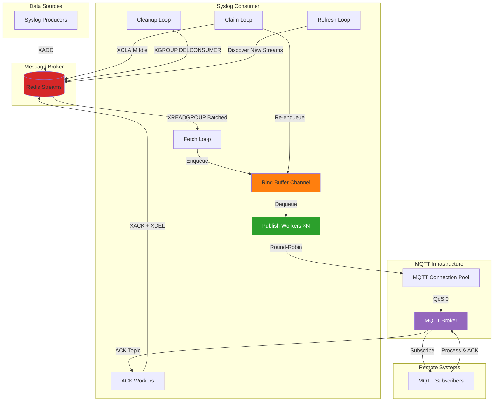

# Syslog Consumer

> A production-grade, zero-data-loss Redis Streams → MQTT message pipeline with lock-free hot path.

[](https://golang.org)
[](LICENSE)
[](default.pgo)

## 🏗 Architecture Overview


```mermaid
graph TB
    subgraph "Data Sources"
        A[Syslog Producers]
    end

    subgraph "Message Broker"
        B[(Redis Streams)]
    end

    subgraph "Syslog Consumer"
        C[Fetch Loop]
        D[Ring Buffer Channel]
        E[Publish Workers ×N]
        F[Claim Loop]
        G[Cleanup Loop]
        H[Refresh Loop]
        I[ACK Workers]
    end

    subgraph "MQTT Infrastructure"
        J[MQTT Connection Pool]
        K[MQTT Broker]
    end

    subgraph "Remote Systems"
        L[MQTT Subscribers]
    end

    A -->|XADD| B
    B -->|XREADGROUP Batched| C
    C -->|Enqueue| D
    D -->|Dequeue| E
    E -->|Round-Robin| J
    J -->|QoS 0| K
    K -->|Subscribe| L
    L -->|Process & ACK| K
    K -->|ACK Topic| I
    I -->|XACK + XDEL| B
    F -->|XCLAIM Idle| B
    F -->|Re-enqueue| D
    G -->|XGROUP DELCONSUMER| B
    H -->|Discover New Streams| B

    style D fill:#ff7f0e
    style E fill:#2ca02c,color:#fff
    style B fill:#d62728
    style K fill:#9467bd,color:#fff
```

## ✨ Key Features

- 🚀 **Lock-Free Pipeline** — Go channels for thread-safe communication without mutexes
- 📋 **Zero-Copy Processing** — payload built directly from Redis values with pooled `jsonfast.Builder`
- 🔄 **At-Least-Once Delivery** — Redis pending entries + automatic claim loop for crash recovery
- 🌊 **Multi-Stream Support** — dynamic discovery and parallel consumption of all Redis streams
- 🔌 **MQTT Connection Pooling** — round-robin load balancing across configurable pool size
- 🛡️ **TLS/mTLS** — full encryption and mutual authentication with automatic certificate renewal
- 📊 **Self-Contained Messages** — each message carries all metadata for stateless processing
- ⚙️ **PGO-Optimized** — profile-guided optimization for ~5–15% throughput gain in production

## 🚀 Quick Start

### 📦 Installation

```bash
git clone https://github.com/ibs-source/syslog-consumer.git
cd syslog-consumer
make build-pgo
```

Requires **Go 1.25+**, a reachable **Redis 6+** instance, and an **MQTT 3.1.1** broker.

### 💡 Basic Usage

```bash
# Run with defaults (single-stream mode)
./syslog-consumer

# Custom configuration via environment
export REDIS_ADDRESS="redis.example.com:6379"
export REDIS_STREAM="syslog-stream"
export MQTT_BROKER="tcp://mqtt.example.com:1883"
./syslog-consumer

# Multi-stream mode: discovers all Redis streams automatically
export REDIS_STREAM=""
./syslog-consumer
```

### 🐳 Docker

```bash
docker build -t syslog-consumer:latest .

docker run -d \
  -e TENANT=mytenant \
  -e CERTIFICATE_DEPLOYER_KEY=secret \
  -e BROKER=ssl://syslog.ibs.cloud:8883 \
  syslog-consumer:latest
```

## 📖 Configuration

All configuration via environment variables. Flags override environment where applicable.

### Redis

| Variable | Default | Description |
|----------|---------|-------------|
| `REDIS_ADDRESS` | `localhost:6379` | Redis server address |
| `REDIS_STREAM` | `syslog-stream` | Stream name (empty = multi-stream) |
| `REDIS_CONSUMER` | `consumer-1` | Consumer name |
| `REDIS_GROUP_NAME` | `consumer-group` | Consumer group name |
| `REDIS_BATCH_SIZE` | `20000` | Messages per XREADGROUP |
| `REDIS_POOL_SIZE` | `50` | Connection pool size |
| `REDIS_MIN_IDLE_CONNS` | `10` | Warm idle connections |
| `REDIS_BLOCK_TIMEOUT` | `1s` | XREADGROUP block timeout |
| `REDIS_CLAIM_IDLE` | `10s` | Min idle before reclaiming pending |
| `REDIS_CONSUMER_IDLE_TIMEOUT` | `5m` | Dead consumer threshold |
| `REDIS_CLEANUP_INTERVAL` | `1m` | Dead consumer cleanup interval |
| `REDIS_DIAL_TIMEOUT` | `5s` | Connection dial timeout |
| `REDIS_READ_TIMEOUT` | `3s` | Read timeout |
| `REDIS_WRITE_TIMEOUT` | `3s` | Write timeout |
| `REDIS_PING_TIMEOUT` | `3s` | Ping timeout |
| `REDIS_DISCOVERY_SCAN_COUNT` | `1000` | SCAN COUNT hint for multi-stream discovery |

### MQTT

| Variable | Default | Description |
|----------|---------|-------------|
| `MQTT_BROKER` | `tcp://localhost:1883` | Broker URL |
| `MQTT_CLIENT_ID` | `syslog-consumer` | Client identifier |
| `MQTT_PUBLISH_TOPIC` | `syslog/remote` | Publish topic |
| `MQTT_ACK_TOPIC` | `syslog/remote/acknowledgement` | ACK subscription topic |
| `MQTT_QOS` | `0` | QoS level |
| `MQTT_POOL_SIZE` | `25` | Connection pool size |
| `MQTT_CONNECT_TIMEOUT` | `10s` | Connection timeout |
| `MQTT_WRITE_TIMEOUT` | `5s` | Publish timeout |
| `MQTT_KEEP_ALIVE` | `60s` | PINGREQ interval |
| `MQTT_PING_TIMEOUT` | `10s` | Max wait for PINGRESP before reconnect |
| `MQTT_CONNECT_RETRY_DELAY` | `2s` | Delay between connection retry attempts |
| `MQTT_MAX_RECONNECT_INTERVAL` | `5s` | Maximum reconnect delay |
| `MQTT_SUBSCRIBE_TIMEOUT` | `10s` | Subscription timeout |
| `MQTT_DISCONNECT_TIMEOUT` | `1s` | Disconnect timeout |
| `MQTT_MESSAGE_CHANNEL_DEPTH` | `10000` | Internal paho outgoing queue depth |
| `MQTT_MAX_RESUME_PUB_IN_FLIGHT` | `1000` | Unacknowledged publishes resumed after reconnect |
| `MQTT_TLS_INSECURE_SKIP` | `false` | Skip server certificate verification |

### MQTT TLS (optional)

| Variable | Default | Description |
|----------|---------|-------------|
| `MQTT_TLS_ENABLED` | `false` | Enable TLS |
| `MQTT_CA_CERT` | — | CA certificate path |
| `MQTT_CLIENT_CERT` | — | Client certificate path |
| `MQTT_CLIENT_KEY` | — | Client key path |
| `MQTT_USE_CERT_CN_PREFIX` | `false` | Prefix topics with certificate CN |

### Pipeline

| Variable | Default | Description |
|----------|---------|-------------|
| `PIPELINE_PUBLISH_WORKERS` | `50` | Concurrent publish workers |
| `PIPELINE_ACK_WORKERS` | `50` | Concurrent ACK workers |
| `PIPELINE_BUFFER_CAPACITY` | `10000` | ACK channel depth |
| `PIPELINE_MESSAGE_QUEUE_CAPACITY` | `500` | Fetch→publish queue depth |
| `PIPELINE_SHUTDOWN_TIMEOUT` | `10s` | Graceful shutdown timeout |
| `PIPELINE_ERROR_BACKOFF` | `50ms` | Sleep on Redis error |
| `PIPELINE_REFRESH_INTERVAL` | `1m` | Multi-stream discovery interval |
| `PIPELINE_HEALTH_ADDR` | `:9980` | Health endpoint bind address |
| `PIPELINE_ACK_TIMEOUT` | `5s` | Timeout for ACK operations |
| `PIPELINE_ACK_BATCH_SIZE` | `256` | Immediate flush threshold for batched ACKs |
| `PIPELINE_ACK_FLUSH_INTERVAL` | `10ms` | Timer interval for flushing batched ACKs |
| `PIPELINE_HEALTH_PING_TIMEOUT` | `2s` | Redis ping timeout in health check |
| `PIPELINE_HEALTH_READ_HEADER_TIMEOUT` | `5s` | Health server HTTP read header timeout |

### Compression

| Variable | Default | Description |
|----------|---------|-------------|
| `COMPRESS_FREELIST_SIZE` | `128` | Decoder freelist channel capacity |
| `MAX_DECOMPRESS_BYTES` | `256MiB` | Hard cap for a single decompressed payload (zip bomb protection) |
| `COMPRESS_WARMUP_COUNT` | `4` | Decoders pre-created at init to avoid cold-start latency |

### General

| Variable | Default | Description |
|----------|---------|-------------|
| `LOG_LEVEL` | `info` | Log level: `trace`, `debug`, `info`, `warn`, `error`, `fatal`, `panic` |

## 📦 Message Format

**Published payload** (tab-separated: `id\tstream\t{flat JSON}`):
```
1699459800000-0	syslog-stream	{"timestamp":"2025-11-08T16:30:00Z","severity":"Info","facility":"syslog","raw":"-"}
```

**ACK payload** (from remote system):
```json
{"ids":["1699459800000-0"],"stream":"syslog-stream","ack":true}
```

- `ack:true` → XACK + XDEL (message finalized)
- `ack:false` → leave pending for retry via claim loop

## ⚡ Pipeline Flow

1. **Fetch** — batched XREADGROUP from Redis (single or multi-stream)
2. **Enqueue** — push to lock-free ring buffer channel
3. **Publish** — N workers pull from buffer, build self-contained payload, publish via MQTT pool
4. **ACK** — remote system processes and publishes ACK back; consumer performs XACK + XDEL
5. **Claim** — periodically reclaims idle pending entries older than `REDIS_CLAIM_IDLE`
6. **Cleanup** — periodic removal of dead consumers by idle timeout
7. **Refresh** — periodic stream discovery for multi-stream mode

## 🧪 Testing

```bash
make test        # All tests
make test-race   # With race detector
make test-cover  # Coverage report
make lint        # golangci-lint
make vet         # Static analysis
```

## ⚙️ Build & PGO

```bash
make build       # Standard build
make build-pgo   # PGO-optimized build (~5-15% throughput gain)
make pgo         # Regenerate PGO profile from benchmarks
make docker-build # Docker image
```

## 🛡️ Security

- **TLS/mTLS** for MQTT with automatic certificate renewal via `wrapper`/`manager` scripts
- **Non-root** container user
- **HEALTHCHECK** built into Dockerfile
- **GC tuning**: `GOGC=200`, `GOMEMLIMIT=4GiB`, `GOEXPERIMENT=greenteagc`
- Never hardcode credentials — inject `CERTIFICATE_CERTIFICATE_DEPLOYER_KEY` at runtime via secrets

For security policy and vulnerability reporting, see [SECURITY.md](SECURITY.md).

## 🧠 Design Principles

1. **Stateless design.** All state in Redis for crash recovery — no local caching.
2. **Self-contained messages.** Each message carries all metadata for processing.
3. **Fail-fast configuration.** Validate all settings at startup before connecting.
4. **Horizontal scalability.** Add consumer instances without coordination.
5. **Lock-free hot path.** Go channels and atomic operations — no mutexes.
6. **Observable.** Structured logging with configurable levels.

## 📁 Project Structure

```
syslog-consumer/
├── cmd/consumer/main.go               # Application entry point
├── internal/
│   ├── config/                         # Environment-based configuration with validation
│   ├── hotpath/                        # Pipeline orchestrator (fetch, publish, claim, cleanup)
│   ├── redis/                          # Redis Streams client with multi-stream support
│   ├── mqtt/                           # MQTT client, connection pool, ACK parsing
│   ├── compress/                       # Zstd compression utilities
│   ├── message/                        # Message types (RedisMessage, AckMessage)
│   ├── health/                         # HTTP health check server
│   ├── metrics/                        # Prometheus metrics (placeholder)
│   └── log/                            # Structured logger
├── wrapper                             # Container entrypoint (cert lifecycle + process monitor)
├── manager                             # Certificate manager (expiration, revocation, renewal)
├── healthcheck                         # Docker HEALTHCHECK script
├── default.pgo                         # PGO profile for production builds
├── Dockerfile                          # Multi-stage production image
├── Makefile                            # Build, test, bench, lint, PGO
├── ARCHITECTURE.md                     # System architecture documentation
├── CONTRIBUTING.md                     # Contribution guidelines
├── SECURITY.md                         # Security policy
└── LICENSE                             # License
```

## 🤝 Contributing

Contributions are welcome. Please fork the repository, create a feature branch, and submit a pull request.

For contribution guidelines, see [CONTRIBUTING.md](CONTRIBUTING.md).

---

## 🔖 Versioning

We use [SemVer](https://semver.org/) for versioning. For available versions, see the [tags on this repository](https://github.com/ibs-source/syslog-consumer/tags).

---

## 👤 Authors

- **Paolo Fabris** — _Initial work_ — [ubyte.it](https://ubyte.it/)

See also the list of [contributors](https://github.com/ibs-source/syslog-consumer/contributors) who participated in this project.

## 📄 License

This project is licensed under the terms in the [LICENSE](LICENSE) file.

---

## ☕ Support This Project

If syslog-consumer has been useful for your infrastructure, consider supporting its development:

[](https://coff.ee/ubyte)

---

**Star this repository if you find it useful.**

For questions, issues, or contributions, visit our [GitHub repository](https://github.com/ibs-source/syslog-consumer).
